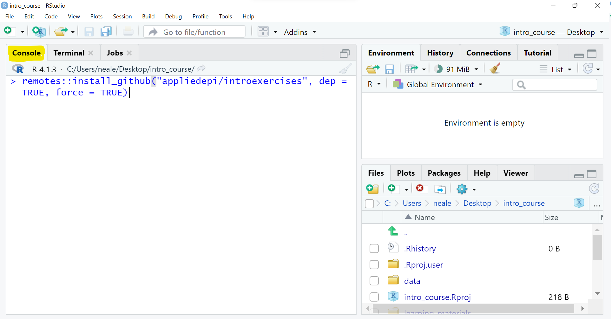
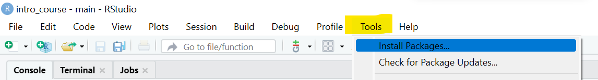

#  {.unnumbered}

```{r, out.width = "100%", fig.align = "center", echo=F}
knitr::include_graphics(xfun::relative_path("images/index/applied_epi_banner.png"))
```

<meta name="description" content="Training materials for using R in applied epidemiology and public health">

<meta http-equiv="Content-Type" content="text/html; charset=utf-8">

## Home page for Applied Epi R courses {.unnumbered}

**See the table of contents on the right to access the course materials**

*Access to exercises is only available to participants in Applied Epi courses.*  


## About {.unnumbered}


:::: {style="display: flex;"}

::: {}

**[Applied Epi](https://appliedepi.org/) is a nonprofit organization that supports frontline public health practitioners through accessible tools, training, and support.**  

We are a global team of 170 applied epidemiologists and public health practitioners with extensive ground-level experience.  

Our free [Epidemiologist R Handbook](https://epiRhandbook.com) is a vital resource for over **450,000 people worldwide**.  

:::


::: {}
```{r, out.width = "100%", fig.align = "center", echo=F}
knitr::include_graphics(xfun::relative_path("images/AE_R_training_support_pyramid.png"))
```
:::

::::

</br>
</br>

We offer a comprehensive ecosystem of training, tools, and support:  

:::: {style="display: flex;"}

::: {}
```{r, out.width = "55%", fig.align = "left", echo=F}
knitr::include_graphics("images/teaching_icon.png")
```

**Training:**  
**[Live courses](https://appliedepi.org/live/)**  
**[Tutorials](https://appliedepi.org/tutorial/)**  
**[Case studies](https://appliedepi.org/case/)**  
:::

::: {}
```{r, out.width = "55%", fig.align = "left", echo=F}
knitr::include_graphics("images/tools_icon.png")
```

**Tools:**  
**[Epi R Handbook](https://epiRhandbook.com)**  
**[R packages](https://appliedepi.org/tools/)**  
**[Sitrep templates](https://appliedepi.org/tools/)**  
:::

::: {}
```{r, out.width = "55%", fig.align = "left", echo=F}
knitr::include_graphics("images/QA_icon.png")
```

**Support:**  
**[Community forum](https://community.appliedepi.org)**  
**[R Help Desk](https://appliedepi.org/helpdesk/)**  
**[Mentorship](https://appliedepi.org/join/)**  
:::


::::


<form target="_blank" action="https://www.paypal.com/donate" method="post" target="_top">
<input type="hidden" name="hosted_button_id" value="YTEZELC8VBXV6" />
<input type="image" src="https://github.com/appliedepi/epiRhandbook_eng/raw/master/images/donate_button_long.png" border="0" name="submit" title="PayPal - The safer, easier way to pay online!" alt="Donate with PayPal button" />

</form>


-   Email [**contact\@appliedepi.org**](mailto:contact@appliedepi.org) or [**join our contact list**](https://forms.gle/9awNd8syypTSYUsn7)  


<!-- ======================================================= -->
## Acknowledgements {.unnumbered}  

Please note that all of our training materials use *fake example data* in which no person is identifiable and the actual values have been scrambled.  

Authors and contributors to curricula from **Applied Epi** include:  

* Neale Batra, Arran Hamlet, Adam Vaughan, Mathilde Mousset, Olivia Boyd, Alex Spina, Paula Blomquist, Amy Mikhail, and Mara Kont  
* The {outbreaks} package formed the basis for the fake dataset in the Ebola case study.  
* The Fulton County Board of Health provided example data (anonymized and scrambled) for a case study  
* Illustrations are by Calder Fong or Canva  

## Terms of Use {.unnumbered}

These materials are currently restricted to people enrolled in this live course. If you want to offer or use any of these materials in another training course, please contact us first to discuss.  

<!--chapter:end:index.Rmd-->

# (PART) About our trainings {.unnumbered}

<!--chapter:end:pages/cat_about.Rmd-->

# Our educational approach {} 


```{r, out.width = "100%", fig.align = "center", echo=F}
knitr::include_graphics(xfun::relative_path("images/AE_R_training_support_pyramid.png"))
```

<!-- ======================================================= -->
## Our philosophy {.unnumbered}

Applied Epi training materials are constructed with the following principles:  

### We are focused on frontline practitioners {.unnumbered}  

Our efforts are focused on improving the lives of ground-level public health practitioners and applied epidemiologists - the vast workforce at local and national health agencies, NGOs, and healthcare systems.  

We believe that most actionable public health intelligence derives from the frontline workforce. They have the most to benefit from R adoption, and their needs have historically been underserved by R developers.  

Therefore, our course content focus on the tasks, visualizations, and analyses most common in practical, applied epidemiology and public health.  


### We are curators on your behalf  {.unnumbered} 

We have leveraged our decades of experience using R and working in frontline epidemiology in order to *distill the vast universe of R packages and functions into the most easy and relevant approaches for beginners in public health practice*.  

R is notorious for having many ways to do the same thing. We've reviewed the options, and have chosen the easiest and best ones for you.  


### Thoughtful and deliberate curriculum {.unnumbered} 

To facilitate learning and reduce mental load, we are intentional with our vocabulary, choice of terms, methodological consistency, and the progression of skills that we introduce.  


### Building confidence to "tinker"  {.unnumbered}

The best (perhaps only) way to learn a new language like R is to "tinker", or to experiment and learn via trial and error. We build this into our courses by progressively encouraging you to write original code and understand R documentation and error messages.  


### Setting you up to actually use R  {.unnumbered}

Some R courses have students work only in a virtual R environment (it is less hassle for instructors).  

In our live courses, we embrace the challenges of setting up R on *your computer*. This means dedicating time to work through the complications posed by employer security restrictions, other software such as OneDrive, VPNs, package downloads, and previous R installations.  

Our self-paced tutorials are intended for larger audiences and therefore cannot include the personal attention to troubleshoot R setup on your computer. Nevertheless, we focus on building coding skills within the tutorial, address R setup when possible, and offer "office hours" sessions for assistance.  

 

<!--chapter:end:pages/approach.Rmd-->

# (PART) Intro course {.unnumbered}

<!--chapter:end:pages/cat_intro.Rmd-->


# Intro course (EN) {} 


```{r, out.width = "100%", fig.align = "center", echo=F}
knitr::include_graphics(xfun::relative_path("images/index/applied_epi_banner.png"))
```

<!-- ======================================================= -->
## Overview {.unnumbered}

```{r, out.width = "50%", fig.align = "center", echo=F}

```
[*Image: Neale Batra*]{style="float:right"}


## Course tutoring

As an enrolled participant, you can book 20-minute calls with an instructor (1-on-1) using **[this booking link](https://calendly.com/applied-epi/course-support-en)**. These calls are for questions about the course materials (not other personal/work projects). You may book these during your course period, and one week following.  


<!-- ======================================================= -->
## Modules {.unnumbered}  

Below is a list of each of the modules included in the course. Please work your way through them systemically - in accordance with the course timetable. Clicking on an exercise link will prompt a login, then launch a window with the interactive exercise. 


::: {.tutorial}
**Pre-course preparation**

Follow these step-by-step instructions to intall software, download the course files, setup an RStudio project, and to download and begin the course's interactive exercises.  

**Click on each of the steps below to expand the instructions**  


<!--
NOTE: everything inside the details tag will be collapsed and effectively
hidden from the user
-->


<details markdown=1><summary markdown="span" style='text-decoration: underline'>Install software</summary>  
  
Please have the following software installed on your computer **prior to the start of the course**.  

See this [installation guide](https://appliedepi.org/files/install_guide.pdf) for tips.  

1) [R](https://cran.r-project.org/bin/windows/base/) (most recent version)
2) [RStudio](https://www.rstudio.com/products/rstudio/download/#download) (most recent version)
3) [RTools](https://cran.r-project.org/bin/windows/Rtools/) (only needed for Windows machines)

</details>


<details markdown=1><summary markdown="span" style='text-decoration: underline'>Download course files</summary>  
  
Download the zipped course folder at [**this link**](https://appliedepi.org/files/intro_course.zip).  

**Unzip/extract the folder and save it on your computer's desktop (not on a shared drive).** 

To "unzip" a folder once it is downloaded, right-click on the folder and select "Extract All". If offered a choice of location to save the unzipped folder, save it to your desktop.  

On your desktop:  


* `r emo::ji("folder")` Desktop
  * `r emo::ji("folder")` intro_course
     * `r emo::ji("folder")` data
     * `r emo::ji("folder")` scripts
     * `r emo::ji("folder")` outputs
     * `r emo::ji("folder")` learning_materials
     * `r emo::ji("document")` surveillance_linelist_20141201.csv

<!-- `r emo::ji("warning")` You may also have some other files. Just leave them.   -->


<!-- * `r emo::ji("folder")` intro_course   -->
<!--      * `r emo::ji("folder")` data -->
<!--           * `r emo::ji("folder")` clean   -->
<!--           * `r emo::ji("folder")` raw   -->
<!--           * `r emo::ji("folder")` pop   -->
<!--           * `r emo::ji("folder")` shp   -->
<!--      * `r emo::ji("folder")` scripts -->
<!--      * `r emo::ji("folder")` outputs   -->
<!--      * `r emo::ji("folder")` learning_materials   -->
<!--           * `r emo::ji("folder")` covid_case_study   -->
<!--           * `r emo::ji("folder")` backup_r_packages   -->
<!--      * `r emo::ji("document")` surveillance_linelist_20141201.csv -->

<!-- `r emo::ji("warning")` You may also have some other files. Just leave them.   -->

</details>


<details markdown=1><summary markdown="span" style='text-decoration: underline'>Install R packages</summary>  
  
Now, go into the "intro_course" folder, and click into the subfolders "scripts" and "backup". There you will see a file named "packages_to_install.R". Double click, and if necessary select that you want to open the file using *RStudio*. The file should open in RStudio. 

Read the instructions written at the top of the script. You should highlight ALL the text in the script and then press the "Run" button located near the top-center of RStudio. Alternatively, you can highlight all the text and then press the keys Ctrl and Enter.  

This script will spend several minutes to install most of the R packages that you need for this course.  

</details>


<details markdown=1><summary markdown="span" style='text-decoration: underline'>Create a new RStudio project</summary>  
  

1) Open RStudio (ensure that you open *RStudio* and not just *R*).  

2) In RStudio click *File -> New Project*. In the pop-up window, select **"Existing directory"**.  

```{r, eval = TRUE, echo = FALSE, out.width = "50%"}
knitr::include_graphics("images/intro_course_images/create_project.png")
```

3) Click "browse" and select the "intro_course" folder on your desktop, containing the course materials, which you downloaded earlier. Then click "Create project".  

Voila! This will be the project for all of your work in this course.  


</details>


<details markdown=1><summary markdown="span" style='text-decoration: underline'>Access the course exercises online</summary>  
  
Begin the course exercises using the links in the "Modules" section below. You will need an Applied Epi account (link provided by instructor in welcome email, or use [this link](community.appliedepi.org)).  

* Turn off any VPN  
* If you see "Error 403: Forbidden" notify your instructor to give you access to the exercises. After access is given, you will need to clear your cache, or re-open the exercise in a private/incognito window for today.  
* If your internet connection is too weak, see the steps below to access the exercises offline.  


</details>


<details markdown=1><summary markdown="span" style='text-decoration: underline'>Offline access to course exercises</summary>  

If you require offline access, please contact your instructor.

<!-- A further backup method is described below, but will require permissions from an instructor: -->

<!-- **Copy and paste this command into your R Console as shown below, then press the "Enter" key to run the command:** -->

<!-- >`remotes::install_github("appliedepi/introexercises", dep = TRUE, force = TRUE)` -->

<!-- ```{r, eval = TRUE, echo = FALSE, out.width = "75%"} -->
<!--  -->
<!-- ``` -->

<!-- Text will begin to appear in the Console, below the command. Do not worry, R is simply downloading the tutorials from the internet and printing updates. *Watch the print-out for any questions that R may ask you:* -->

<!--   * If you encounter an error referencing HTTP or "proxy", then downloading from Github may be blocked by your institution. Proceed to the backup steps below. -->
<!--   * If you see a printed warning about needing "RTools", do not worry. This is simply a warning message and the install should proceed without error. -->
<!--   * If prompted to update some R packages, select "All" to update all of the packages. If you continue to be prompted for package updates, you can select "None" and continue without further updates. -->

<!-- **Backup option:** -->

<!-- **Go to the "Tools" menu of RStudio, and select "Install packages".** -->

<!-- ```{r, eval = TRUE, echo = FALSE, out.width = "75%"} -->
<!--  -->
<!-- ``` -->

<!-- **In the pop-up window, select "zip" from the first drop-down menu.** -->

<!-- ```{r, eval = TRUE, echo = FALSE, out.width = "50%"} -->
<!-- knitr::include_graphics("images/intro_course_images/zip_drop_down.png") -->
<!-- ``` -->

<!-- **Another window should appear to select a file (if not, select "Browse"). Navigate to the folder "Desktop/intro_courses/learning_materials/backup_r_packages".** Note the 8 zipped folders here - each one is an R package. Select the first one "basket", press "Open", then click "Install". R will run a brief command to install this package. **Repeat this step to install each of the 8 zipped folders.** -->

<!-- ```{r, eval = TRUE, echo = FALSE, out.width = "75%"} -->
<!-- knitr::include_graphics("images/intro_course_images/zip_package_select.png") -->
<!-- ``` -->

<!-- If continuing to experience errors, you may need to restart R, and then run the following command:   -->

<!-- >`install.packages(c("tibble", "cli", "magrittr", "tidyr", "cli", "rlang", "tibble", "dplyr", "cachem", "fastmap"))`   -->

<!-- Your instructor can continue to troubleshoot with you.  -->

<!-- Now, the course exercises will appear *within your RStudio* offline. Each course module has a corresponding exercise, which can be accessed through the "Tutorials" pane in RStudio (upper-left). The gif below introduces you to the exercise environment (you do not need to follow the steps shown right now).   -->

<!-- ```{r, eval = TRUE, echo = FALSE, out.width = "100%"} -->
<!-- knitr::include_graphics("images/intro_course_images/exercise_demo_short_words.gif") -->
<!-- ``` -->

<!-- 1) Click on the "Tutorial" tab in the upper-right RStudio pane (which also contains a tab holding your "Environment").   -->
<!--   * Scroll down and review the listed exercises. If you do not see any "Applied Epi" exercises listed, close and re-open RStudio. They may take a minute to appear.   -->

<!-- 2) Select the exercise, for example: "Applied Epi - R setup, syntax, data import"   -->
<!--   * The exercise will load. Once you see the Applied Epi logo appear in the Tutorials pane, you can begin the exercise.   -->
<!--   * To see the sidebar in the exercise, you may need to adjust the Tutorials pane to be wider. You can also adjust the zoom from the "View" menu.   -->
<!--   * You can view the exercise in this pane, or click the small icon in the upper-left to pop-out into a separate window.   -->


</details>


:::


::: {.tutorial}
**Module 1: Introduction to R Syntax**

We welcome you to the course, review course logistics, detail the support resources available to you.  

Next, we dive into a coding demonstration to introduce you to R and RStudio. We cover the basics of how to interact with R and RStudio, R syntax and running commands, and we cover R functions and packages.  

- [Slides: Welcome, course logistics, RStudio, and basic R syntax](https://appliedepi.github.io/slides/intro/en/module_1/module_1.html)  

- [Exercise: R setup, basic syntax, functions, and packages](http://exercises.appliedepi.org/app/basics) 

- [Video: Lecture, Demo, Debrief](https://files.appliedepi.org/media/mod1)
:::


::: {.tutorial}
**Module 2: File management, Data import, and inspecting a dataset**

We cover file management strategies, how to work within an RStudio project, and introduce our recommended packages functions used to import and review data. Using these functions, we import the case study's Ebola surveillance linelist, and begin to inspect it.  

- [Slides: RStudio projects, importing data, filepaths](https://appliedepi.github.io/slides/intro/en/module_2/module_2.html)  

- [Exercise: File management and data import](http://exercises.appliedepi.org/app/files_import)  

- [Video: Lecture, Demo, Debrief](https://files.appliedepi.org/media/mod2)
:::


::: {.tutorial}
**Module 3: Data cleaning - part 1**

Now that we have imported our surveillance linelist, we review which "data cleaning" steps might be necessary and how to execute these in R. Along the way, we introduce the core principles of "tidy data".  

Through data cleaning, we teach you the core R functions for handling data, including for standardizing and editing column names, de-duplicating and filtering rows, selecting and modifying columns, re-coding values, and more.  

Together, we write a sequence of "pipes" to clean the linelist step-by-step in a clear, reproducible manner... so that our dataset is ready for preliminary analysis!  

- [Slides: Tidy data and data cleaning](https://appliedepi.github.io/slides/intro/en/module_3/module_3.html)  
  
- [Exercise: Cleaning data - part 1](http://exercises.appliedepi.org/app/cleaning)  

- [Video: Lecture, Demo, Debrief](https://files.appliedepi.org/media/mod3)

:::


::: {.tutorial}
**Module 4: Data cleaning - part 2**

We continue writing our data cleaning code, covering more advanced re-coding, filtering rows, exporting data, and some additional practice exercises.  

- [Slides: Data cleaning part 2](https://appliedepi.github.io/slides/intro/en/module_4/module_4.html)  

- [Exercise: Cleaning data part 2](http://exercises.appliedepi.org/app/cleaning2)  

- [Video: Lecture, Demo, Debrief](https://files.appliedepi.org/media/mod4)
:::


::: {.tutorial}
**Module 5: Grouping data and summary tables**

Informative tables are the bedrock of epidemiological and public health practice. In this module we introduce three tools to produce tables of summary statistics: {dplyr} for flexibility, {janitor} for speed, and {gtsummary} for beauty.  

Finally, we explore {flextable}, which can be used to customize tables produced by any of the above approaches: adding colors and highlights, and saving tables to Word, PNG, HTML, etc.  

- [Slides: Grouping and summarizing data](https://appliedepi.github.io/slides/intro/en/module_5/module_5.html)   
  

- [Exercise: Grouping data and summary tables](http://exercises.appliedepi.org/app/grouping_summaries)  

- [Video: Lecture, Demo, Debrief](https://files.appliedepi.org/media/mod5)

:::


::: {.tutorial}
**Module 6: Data visualization with {ggplot2}**

Using the {ggplot2} package to maximum effect depends upon understanding how to apply its "grammar of graphics" to build a plot layer-by-layer. We tackle this by introducing the syntax logically and using public health examples - so that you build upon previous knowledge to construct informative and colorful bar plots, scatter plots, histograms, box/violin plots, and line plots.  

We also teach you to write text labels that automatically update with refreshed data (very useful for epidemiological reports!), use colors that are colorblind-friendly, and more.  

- [Slides: Data visualization with ggplot2](https://appliedepi.github.io/slides/intro/en/module_6-1/module_6-1.html)  

- [Exercise: ggplot basics](http://exercises.appliedepi.org/app/ggplot_basics) 

- [Slides: Scales, themes, and labels](https://appliedepi.github.io/slides/intro/en/module_6-2/module_6-2.html)  

- [Exercise: Scales, themes, and lables](https://exercises.appliedepi.org/app/ggplot_scales_themes)  

- [Video: Lectures, Demos, Debrief](https://files.appliedepi.org/media/mod6)


:::


::: {.tutorial}
**Module 7: Transforming data: joins, pivots, and factors**

Public health analytics rarely involves just one data set, so now we practice joining data by adding hospital, laboratory, and case investigation data to our surveillance linelist. We ingrain best practices for conducting joins, and prepare you for doing data transformations independently.  

In the second part of this module, we address *pivoting*, which in R means transforming data between "long" and "wide" formats. This is particularly relevant in public health, where each format has distinct benefits.  

Along the way, we introduce the uses of the "factor" class (R's version of ordered levels in a variable) by constructing a timeline visualization of some patients' pathways through the surveillance/medical system.  

- [Slides: Joining data](https://appliedepi.github.io/slides/intro/en/module_7-1/module_7-1.html)  

- [Exercise: Joining data](http://exercises.appliedepi.org/app/joining)

- [Slides: Pivoting data](https://appliedepi.github.io/slides/intro/en/module_7-2/module_7-2.html)  

- [Exercise: Pivoting data](http://exercises.appliedepi.org/app/pivoting)  

- [Video: Lectures, Demos, Debrief](https://files.appliedepi.org/media/mod7)

:::


::: {.tutorial}
**Module 8: Data visualization for public health**

In this second data visualization module we encourage you to practice learning R independently by reading function documentation (a necessary skill once you leave the class!). We still support you, and give live coding demonstrations for all the topics, as usual.  

We cover the various ways to define "epiweeks" using R, and our recommended approach including a cheatsheet.  

We then tackle visualizations that are central to descriptive epidemiology: the intricacies of crafting an accurate epidemic curve, conveying patterns across three variables using a heat plot, and creating age/sex pyramids to describe demographics. If there is time, we finish with a demonstration of R's GIS/geospatial capabilities.  

- [Exercise: Data visualization for public health](http://exercises.appliedepi.org/app/ggplot_heat_epicurves_pyramids)  

- GIS demo R script can be found in your course folder at: *"intro_course/scripts/backup/5_gis_demo.R"*  

- Your instructor will provide our "cheatsheet" on epidemic weeks and making epicurves  

- [Video: Lecture, Demo, Debrief](https://files.appliedepi.org/media/mod8)

:::


::: {.tutorial}
**Module 9: Reports with R Markdown**

In this module, we take the R code on the Ebola case study that you have been writing throughout the course and convert it into a reproducible, automated report (e.g. Word, PDF, HTML, etc.).  

We teach you the variations in syntax to produce documents that update when incoming data is refreshed and that can be used to inform public health partners and stakeholders.  

- [Slides: R Markdown and routine reports](https://appliedepi.github.io/slides/intro/en/module_9/module_9.html)  
  
- [Exercise: R Markdown](http://exercises.appliedepi.org/app/rmarkdown)  

- [Video: Lecture, Demo, Debrief](https://files.appliedepi.org/media/mod9)

:::


::: {.tutorial}
**Module 10: Final Exercise, and peer code review**
In this last module, your put your skills to the test by writing an R Markdown report using a new dataset - a COVID-19 case linelist.  

Unlike with the Ebola case study, you will not have solution code available to you. Instead, you will be given a Word document to reproduce by writing an R Markdown script. This will require data cleaning, creating common epidemiological plots, joining datasets, and creating descriptive tables.  

If there is time, we perform "peer code reviews" which simultaneously improving your coding skills and teach you how to review others' code. Before closing, we touch upon how to find your particular community of R users and resources available to you for further learning.  

- *Exercise materials*: See the folder "intro_course/learning_materials/covid_case_study" for the Word document report to replicate, the datasets, and a tips sheet.  

- [Video: Lecture, Demo, Debrief](https://files.appliedepi.org/media/mod10)

Consider posting your R code questions in our [Community Forum](http://community.appliedepi.org). Get free answers from experts and other epidemiologists! Here is a video on **how to [post an effective R code question](https://www.youtube.com/watch?v=XIc-VHFeUl8)**.  

:::


<!--chapter:end:pages/intro_modules_en.Rmd-->


# Cours d'introduction (FR) {} 


```{r, out.width = "100%", fig.align = "center", echo=F}
knitr::include_graphics(xfun::relative_path("images/index/applied_epi_banner.png"))
```

<!-- ======================================================= -->

```{r, out.width = "50%", fig.align = "center", echo=F}

```
[*Image: Neale Batra*]{style="float:right"}


## Tutorat de cours

En tant que participant inscrit, vous pouvez réserver des appels de 20 minutes avec un instructeur (1 contre 1) en utilisant **[ce lien de réservation](https://calendly.com/applied-epi/soutien-pour-course)**. Ces appels sont destinés à répondre à des questions sur le matériel de cours (et non sur d'autres projets personnels/professionnels). Vous pouvez réserver ces appels pendant votre période de cours et une semaine après.  


<!-- ======================================================= -->
## Les modules {.unnumbered}  

Vous trouverez ci-dessous une liste de chacun des modules inclus dans le cours. Veuillez les parcourir de manière systématique, en suivant le calendrier du cours. En cliquant sur le lien d'un exercice, vous serez invité à vous connecter, puis à ouvrir une fenêtre avec l'exercice interactif.  


::: {.tutorial}
**Préparation au cours**
Suivez ces instructions étape par étape pour installer le logiciel, télécharger les fichiers du cours, configurer un projet RStudio, et pour télécharger et commencer les exercices interactifs du cours.  

**Cliquez sur chacune des étapes ci-dessous pour développer les instructions.**  

<!--
NOTE : tout ce qui se trouve à l'intérieur de la balise details sera réduit et effectivement
caché à l'utilisateur
-->


<details markdown=1><summary markdown="span" style='text-decoration : underline'>Installation du logiciel</summary>  
  
Veuillez avoir les logiciels suivants installés sur votre ordinateur **avant le début du cours**.  

Consultez ce [guide d'installation](https://appliedepi.org/files/install_guide.pdf) pour obtenir des conseils.  

1) [R](https://cran.r-project.org/bin/windows/base/) (version la plus récente)
2) [RStudio](https://www.rstudio.com/products/rstudio/download/#download) (version la plus récente)
3) [RTools](https://cran.r-project.org/bin/windows/Rtools/) (nécessaire uniquement pour les machines Windows)

</details>


<details markdown=1><summary markdown="span" style='text-decoration : underline'>Télécharger les fichiers du cours</summary>.  
  
Téléchargez le dossier de cours zippé sur [**ce lien**](https://appliedepi.org/files/intro_course_fr.zip).  

**Dézippez/extractez le dossier et enregistrez-le sur le bureau de votre ordinateur (pas sur un disque partagé).** 

Pour "dézipper" un dossier une fois qu'il est téléchargé, cliquez avec le bouton droit de la souris sur le dossier et sélectionnez "Extraire tout". Si vous avez le choix de l'emplacement où enregistrer le dossier dézippé, enregistrez-le sur votre bureau.  

Sur votre bureau :  

* `r emo::ji("folder")` Bureau
  * `r emo::ji("folder")` intro_course
     * `r emo::ji("folder")` data
     * `r emo::ji("folder")` scripts
     * `r emo::ji("folder")` outputs
     * `r emo::ji("folder")` learning_materials
     * `r emo::ji("document")` surveillance_linelist_20141201.csv  

</details>


<details markdown=1><summary markdown="span" style='text-decoration : underline'>Installer les paquets R</summary>  
  
Maintenant, allez dans le dossier "intro_course", et cliquez dans les sous-dossiers "scripts" et "backup". Vous y trouverez un fichier nommé "packages_to_install.R". Double-cliquez, et si nécessaire, sélectionnez que vous voulez ouvrir le fichier en utilisant *RStudio*. Le fichier devrait s'ouvrir dans RStudio. 

Lisez les instructions écrites en haut du script. Vous devez mettre en surbrillance TOUT le texte du script, puis appuyer sur le bouton "Run" situé près du centre supérieur de RStudio. Vous pouvez également mettre tout le texte en surbrillance, puis appuyer sur les touches Ctrl et Entrée.  

Ce script prendra plusieurs minutes pour installer la plupart des paquets R dont vous avez besoin pour ce cours.  

</details>


<details markdown=1><summary markdown="span" style='text-decoration : underline'>Créer un nouveau projet RStudio</summary>  
  

1) Ouvrez RStudio (assurez-vous d'ouvrir *RStudio* et pas seulement *R*).  

2) Dans RStudio, cliquez sur *File -> New Project*. Dans la fenêtre pop-up, sélectionnez **"Existing directory (Dossier existant) "**.  

```{r, eval = TRUE, echo = FALSE, out.width = "50%"}
knitr::include_graphics("images/intro_course_images/create_project.png")
```

3) Cliquez sur "browse" et sélectionnez le dossier "intro_course" sur votre bureau, contenant le matériel de cours, que vous avez téléchargé plus tôt. Puis cliquez sur "Créer un projet".  

Voilà ! Ce sera le projet pour tout votre travail dans ce cours.  


</details>


<details markdown=1><summary markdown="span" style='text-decoration : underline'>Accéder aux exercices du cours en ligne</summary>.  
  
Commencez les exercices du cours en utilisant les liens dans la section "Modules" ci-dessous. Vous aurez besoin d'un compte Applied Epi (lien fourni par l'instructeur dans le courriel de bienvenue, ou utilisez [ce lien] (community.appliedepi.org)).  

* Désactivez tout "VPN"  
* Si vous voyez "Error 403 : Forbidden", demandez à votre instructeur de vous donner accès aux exercices. Une fois l'accès accordé, vous devrez vider votre cache, ou rouvrir l'exercice dans une fenêtre privée/incognito pour aujourd'hui.  
* Si votre connexion internet est trop faible, voir les étapes ci-dessous pour accéder aux exercices hors ligne.  


</details>


:::


::: {.tutorial}
**Module 1 : Introduction à la syntaxe R**

Nous vous souhaitons la bienvenue au cours, passons en revue la logistique du cours et détaillons les ressources d'assistance mises à votre disposition.  

Ensuite, nous nous plongeons dans une démonstration de codage pour vous présenter R et RStudio. Nous abordons les bases de l'interaction avec R et RStudio, la syntaxe R et l'exécution des commandes, ainsi que les fonctions et les packages R.  

- [Diapositives: Bienvenue, logistique du cours, RStudio, et syntaxe R de base](https://appliedepi.github.io/slides/intro/fr/module_1/module_1.html)  

- [Exercise: Configuration de R, syntaxe de base, fonctions et packages](http://exercises.appliedepi.org/app/basics_fr) 

:::


::: {.tutorial}
**Module 2: Gestion des fichiers, importation de données et inspection d'un ensemble de données**

Nous couvrons les stratégies de gestion des fichiers, la façon de travailler au sein d'un projet RStudio, et nous présentons les fonctions de nos paquets recommandés utilisées pour importer et examiner les données. À l'aide de ces fonctions, nous importons la liste de surveillance Ebola de l'étude de cas et commençons à l'inspecter.  

- [Diapositives : Projets RStudio, importation de données, chemins de fichiers](https://appliedepi.github.io/slides/intro/fr/module_2/module_2.html)  
- [Exercice: Gestion des fichiers et importation de données](http://exercises.appliedepi.org/app/files_import_fr)  

:::


::: {.tutorial}
**Module 3: Nettoyage des données - partie 1**

Maintenant que nous avons importé notre liste de lignes de surveillance, nous passons en revue les étapes de "nettoyage des données" qui peuvent s'avérer nécessaires et la manière de les exécuter dans R. En cours de route, nous introduisons les principes fondamentaux des "données ordonnées".  

Grâce au nettoyage des données, nous vous apprenons les fonctions R de base pour le traitement des données, y compris la normalisation et la modification des noms de colonnes, la suppression des doublons et le filtrage des lignes, la sélection et la modification des colonnes, le recodage des valeurs, etc.  

Ensemble, nous écrivons une séquence de "tuyaux" pour nettoyer la liste de lignes étape par étape d'une manière claire et reproductible... afin que notre ensemble de données soit prêt pour une analyse préliminaire !

- [Diapositives : Tidy data et nettoyage des données](https://appliedepi.github.io/slides/intro/fr/module_3/module_3.html)  
  
- [Exercice : Nettoyage des données - partie 1](http://exercises.appliedepi.org/app/cleaning_fr)  

:::


::: {.tutorial}
**Module 4: Nettoyage des données - partie 2**

Nous continuons à écrire notre code de nettoyage des données, en couvrant un recodage plus avancé, le filtrage des lignes, l'exportation des données, et quelques exercices pratiques supplémentaires.  

- [Diapositives: Nettoyage des données - partie 2](https://appliedepi.github.io/slides/intro/fr/module_4/module_4.html)  

- [Exercice: Nettoyage des données - partie 2](http://exercises.appliedepi.org/app/cleaning2_fr)  

:::


::: {.tutorial}
**Module 5: Regroupement des données et tableaux de synthèse**

Les tableaux informatifs sont le fondement de la pratique de l'épidémiologie et de la santé publique. Dans ce module, nous présentons trois outils permettant de produire des tableaux de statistiques sommaires : {dplyr} pour la flexibilité, {janitor} pour la rapidité, et {gtsummary} pour la beauté.  

Enfin, nous explorons {flextable}, qui peut être utilisé pour personnaliser les tableaux produits par l'une ou l'autre des approches ci-dessus : ajout de couleurs et de surbrillance, et sauvegarde des tableaux en Word, PNG, HTML, etc.  

- [Diapositives: Regrouper et résumer les données](https://appliedepi.github.io/slides/intro/fr/module_5/module_5.html)   
  

- [Exercice: Regrouper et résumer les données](http://exercises.appliedepi.org/app/grouping_summaries_fr)  

:::


::: {.tutorial}
**Module 6: La visualisation de données avec {ggplot2}**

L'utilisation optimale du package {ggplot2} dépend de la compréhension de la manière d'appliquer sa "grammaire des graphiques" pour construire un graphique couche par couche. Nous abordons cette question en introduisant la syntaxe de manière logique et en utilisant des exemples de santé publique - de sorte que vous vous appuyiez sur vos connaissances antérieures pour construire des diagrammes à barres, des diagrammes de dispersion, des histogrammes, des diagrammes en boîte/violine et des diagrammes linéaires informatifs et colorés.  

Nous vous apprenons également à écrire des étiquettes de texte qui se mettent automatiquement à jour lorsque les données sont actualisées (très utile pour les rapports épidémiologiques !), à utiliser des couleurs adaptées aux daltoniens, etc.  

- [Diapositives: La visualisation de données avec {ggplot2}](https://appliedepi.github.io/slides/intro/fr/module_6-1/module_6-1.html)  

- [Exercice: Les bases de ggplot2](http://exercises.appliedepi.org/app/ggplot_basics_fr) 

- [Diapositives: Échelles, thèmes et étiquettes](https://appliedepi.github.io/slides/intro/fr/module_6-2/module_6-2.html)  

- [Exercice: Échelles, thèmes et étiquettes](https://exercises.appliedepi.org/app/ggplot_scales_themes_fr) 


:::


::: {.tutorial}
**Module 7: Transformation des données : jointures, pivots et facteurs**

L'analyse de la santé publique implique rarement un seul ensemble de données. Nous allons donc nous entraîner à joindre des données en ajoutant des données d'hôpitaux, de laboratoires et d'enquêtes sur les cas à notre liste de surveillance. Nous vous inculquons les meilleures pratiques pour effectuer des jointures et vous préparons à effectuer des transformations de données de manière indépendante.  

Dans la deuxième partie de ce module, nous abordons le *pivotage*, ce qui, dans R, signifie transformer les données entre les formats "long" et "large". Ceci est particulièrement pertinent dans le domaine de la santé publique, où chaque format présente des avantages distincts.  

En cours de route, nous présentons les utilisations de la classe "facteur" (la version de R des niveaux ordonnés d'une variable) en construisant une visualisation chronologique du parcours de certains patients dans le système de surveillance/médical.  

- [Dispositives: Joindre des données](https://appliedepi.github.io/slides/intro/fr/module_7-1/module_7-1.html)  
- [Exercice: Joindre des données](http://exercises.appliedepi.org/app/joining_fr)

- [Dispositives: Pivoter les données](https://appliedepi.github.io/slides/intro/fr/module_7-2/module_7-2.html)  

- [Exercice: Pivoter les données](http://exercises.appliedepi.org/app/pivoting_fr)  

:::


::: {.tutorial}
**Module 8: Visualisation de données pour la santé publique**

Dans ce deuxième module de visualisation de données, nous vous encourageons à vous entraîner à apprendre R de manière indépendante en lisant la documentation des fonctions (une compétence nécessaire une fois que vous aurez quitté le cours !). Nous continuons à vous soutenir et à faire des démonstrations de codage en direct pour tous les sujets, comme d'habitude.  

Nous couvrons les différentes façons de définir les "épiweeks" à l'aide de R, et notre approche recommandée, y compris une feuille de route.  

Nous abordons ensuite les visualisations qui sont essentielles à l'épidémiologie descriptive : les subtilités de l'élaboration d'une courbe épidémique précise, la transmission de modèles à travers trois variables à l'aide d'un diagramme de chaleur, et la création de pyramides d'âge/sexe pour décrire les données démographiques. S'il reste du temps, nous terminerons par une démonstration des capacités SIG/géospatiales de R.  

- [Exercice: Visualisation de données pour la santé publique](http://exercises.appliedepi.org/app/ggplot_heat_epicurves_pyramids_fr)  

- Le script R de démonstration du SIG se trouve dans le dossier de votre cours: *"intro_course/scripts/backup/5_gis_demo.R"*  

- Votre instructeur vous fournira notre "cheatsheet" sur les semaines d'épidémie et la réalisation d'épicurves.  


:::


::: {.tutorial}
**Module 9: Rapports avec R Markdown**

Dans ce module, nous prenons le code R sur l'étude de cas Ebola que vous avez rédigé tout au long du cours et le convertissons en un rapport automatisé reproductible (par exemple Word, PDF, HTML, etc.).  

Nous vous enseignons les variations de syntaxe pour produire des documents qui se mettent à jour lorsque les données entrantes sont actualisées et qui peuvent être utilisés pour informer les partenaires de la santé publique et les parties prenantes. 

- [Despositives: R Markdown et rapports de routine](https://appliedepi.github.io/slides/intro/fr/module_9/module_9.html)  
  
- [Exercice: R Markdown](http://exercises.appliedepi.org/app/rmarkdown_fr)  

:::


::: {.tutorial}
**Module 10: Exercice final, et examen du code par les pairs**
Dans ce dernier module, vous mettez vos compétences à l'épreuve en rédigeant un rapport R Markdown à l'aide d'un nouvel ensemble de données - une liste linéaire de cas COVID-19.  

Contrairement à l'étude de cas Ebola, vous n'aurez pas de code de solution à votre disposition. Au lieu de cela, on vous donnera un document Word à reproduire en écrivant un script R Markdown. Il faudra nettoyer les données, créer des graphiques épidémiologiques communs, joindre des ensembles de données et créer des tableaux descriptifs.  

S'il reste du temps, nous effectuons des "revues de code par les pairs" qui améliorent simultanément vos compétences en codage et vous apprennent à revoir le code des autres. Avant de conclure, nous expliquons comment trouver votre communauté d'utilisateurs de R et les ressources disponibles pour poursuivre votre apprentissage.  

- *Matériel d'exercice*: Voir le dossier "intro_course/learning_materials/covid_case_study" pour le rapport du document Word à reproduire, les jeux de données et une fiche de conseils.   

:::


<!--chapter:end:pages/intro_modules_fr.Rmd-->


# Вступний курс (UA) {} 


```{r, out.width = "100%", fig.align = "center", echo=F}
knitr::include_graphics(xfun::relative_path("images/index/applied_epi_banner.png"))
```

<!-- ======================================================= -->
## Огляд {.unnumbered}

```{r, out.width = "50%", fig.align = "center", echo=F}

```
[*Image: Neale Batra*]{style="float:right"}


<!-- ======================================================= -->
## Модулі {.unnumbered}  

Нижче наведено список усіх модулів, включених до курсу. Будь ласка, проходьте їх систематично – відповідно до розкладу курсу. При натисканні посилання вправи буде запропоновано увійти в систему, а потім відкриється вікно з інтерактивною вправою.


::: {.tutorial}
**Підготовка до курсу**

Дотримуйтесь цих покрокових інструкцій, щоб встановити програмне забезпечення, завантажити файли курсу, налаштувати проект RStudio, завантажити та розпочати інтерактивні вправи курсу.

**Натисніть на кожен із кроків нижче, щоб розгорнути інструкції**.  


<!--
ПРИМІТКА: все, що знаходиться всередині тега details, буде згорнуто і фактично
приховано від користувача
-->


<details markdown=1><summary markdown="span" style='text-decoration: underline'>Встановлення програмного забезпечення</summary>  
  
Будь ласка, встановіть наступне програмне забезпечення на ваш комп'ютер **до початку курсу**.  

Дивіться цей [посібник зі встановлення](https://appliedepi.org/files/install_guide.pdf) для отримання порад.

1) [R](https://cran.r-project.org/bin/windows/base/) (остання версія)
2) [RStudio](https://www.rstudio.com/products/rstudio/download/#download) (остання версія)
3) [RTools](https://cran.r-project.org/bin/windows/Rtools/) (потрібно лише для машин під керуванням Windows).

</details>


<details markdown=1><summary markdown="span" style='text-decoration: underline'>Завантажити файли курсу</summary>  
  

Скачайте заархівовану папку курсу [**цим посиланням**](https://appliedepi.org/files/intro_course_ua.zip).  

**Розархівуйте/розпакуйте папку та збережіть її на робочому столі комп'ютера (не на спільному диску)**. 

Щоб "розпакувати" папку після її завантаження, клацніть правою кнопкою миші на папці та виберіть "Витягнути все". Якщо вам запропонують вибрати місце для збереження розархівованої папки, збережіть її на робочому столі.

На робочому столі:  


* `r emo::ji("folder")` Робочий стіл.
  * `r emo::ji("folder")` intro_course
     * `r emo::ji("folder")` data
     * `r emo::ji("folder")` scripts
     * `r emo::ji("folder")` outputs
     * `r emo::ji("folder")` learning_materials
     * `r emo::ji("document")` surveillance_linelist_20141201.csv


</details>


<details markdown=1><summary markdown="span" style='text-decoration: underline'>Встановлення пакетів R</summary>  
  
Тепер зайдіть в папку "intro_course" і клацніть на підпапках "scripts" і "backup". Там ви побачите файл із ім'ям "packages_to_install.R". Двічі клацніть по ньому та за потреби виберіть, що ви хочете відкрити файл за допомогою *RStudio*. Файл повинен відкрити RStudio. 

Прочитайте вказівки, написані у верхній частині скрипта. Ви повинні виділити ВЕСЬ текст у скрипті, а потім натиснути кнопку "Run", розташовану у верхній центральній частині RStudio. Також можна виділити весь текст, а потім натиснути клавіші Ctrl і Enter.  

Цей скрипт витратить кілька хвилин на встановлення більшості пакетів R, які вам знадобляться для цього курсу. 

</details>


<details markdown=1><summary markdown="span" style='text-decoration: underline'>Створіть новий проект RStudio</summary>  
  

1) Відкрийте RStudio (переконайтеся, що ви відкрили *RStudio*, а не просто *R*).

2) У RStudio натисніть *"Файл -> Новий проект"*. У спливаючому вікні виберіть **Existing directory**.  

```{r, eval = TRUE, echo = FALSE, out.width = "50%"}
knitr::include_graphics("images/intro_course_images/create_project.png")
```

3) Натисніть кнопку "browse" та виберіть папку "intro_course" на робочому столі, що містить матеріали курсу, які ви завантажили раніше. Потім натисніть "Створити проект".  

Вуаль! Це буде проект для вашої роботи в цьому курсі.  


</details>


<details markdown=1><summary markdown="span" style='text-decoration: underline'>Доступ до вправ курсу онлайн</summary>

Почніть виконувати вправи курсу, використовуючи посилання в розділі Модулі нижче. Вам знадобиться обліковий запис Applied Epi (посилання надана викладачем у вітальному листі, або використовуйте [це посилання](community.appliedepi.org)).  

* Вимкніть будь-яку VPN  
* Якщо ви бачите "Помилка 403: Forbidden", повідомте інструктора, щоб він надав вам доступ до вправ. Після отримання доступу вам потрібно буде очистити кеш або відкрити вправу в приватному вікні/інкогніто.  
* Якщо ваше інтернет-з'єднання занадто слабке, дивіться кроки нижче, щоб отримати доступ до вправ в автономному режимі.  


</details>


<details markdown=1><summary markdown="span" style='text-decoration: underline'>Офлайновий доступ до вправ курсу</summary>  

Офлайн-версії вправ доступні у папці "intro_course/learning_materials/backup_exercises/".


</details>


:::


::: {.tutorial}
**Модуль 1: Введення в синтаксис R**.  

Ми вітаємо вас на курсі, розглядаємо логістику курсу, детально розповідаємо про доступні вам ресурси підтримки.  

Далі ми поринемо в демонстрацію кодування, щоб познайомити вас з R та RStudio. Ми розглянемо основи взаємодії з R та RStudio, синтаксис R та виконання команд, а також функції та пакети R.  

- [Слайди: вітання, логістика курсу, RStudio та базовий синтаксис R](https://appliedepi.github.io/slides/intro/ua/module_1/module_1.html)  

- [Вправа: налаштування R, базовий синтаксис, функції та пакети](http://exercises.appliedepi.org/app/basics_ua) 

:::


::: {.tutorial}
**Модуль 2: Керування файлами, імпорт даних та перевірка набору даних**.

Ми розглянемо стратегії управління файлами, роботу в проекті RStudio і надамо рекомендовані функції пакетів, які використовуються для імпорту та перевірки даних. Використовуючи ці функції, ми імпортуємо лінійний список даних епіднагляду за Еболою і приступаємо до його перевірки.  

- [Слайды: проекты RStudio, импорт данных, пути файлов](https://appliedepi.github.io/slides/intro/ua/module_2/module_2.html)  
- [Вправа: Керування файлами та імпорт даних](http://exercises.appliedepi.org/app/files_import_ua)  

:::


::: {.tutorial}
**Модуль 3: Очищення даних – частина 1**

Тепер, коли ми імпортували наш лінійний список спостережень, ми розглянемо, які кроки з "очищення даних" можуть знадобитися і як їх виконати в R. Принагідно ми познайомимо вас з основними принципами "акуратних даних".  

У процесі очищення даних ми навчимо вас основним функціям R для роботи з даними, включаючи стандартизацію та редагування імен стовпців, видалення дублікатів та фільтрацію рядків, вибір та зміна стовпців, перекодування значень та багато іншого.  

Разом ми напишемо послідовність "труб" для очищення списку рядків крок за кроком у зрозумілій манері, що відтворюється... так що наш набір даних готовий до попереднього аналізу!  

- [Слайди: Охайні дані та очищення даних](https://appliedepi.github.io/slides/intro/ua/module_3/module_3.html)  
  
- [Вправа: Очищення даних – частина 1](http://exercises.appliedepi.org/app/cleaning_ua)  

:::


::: {.tutorial}
**Модуль 4: Очищення даних – частина 2**

Ми продовжуємо писати наш код очищення даних, охоплюючи більш просунуте перекодування, фільтрацію рядків, експорт даних та деякі додаткові практичні вправи.  

- [Слайди: Очищення даних частина 2](https://appliedepi.github.io/slides/intro/ua/module_4/module_4.html)  

- [Вправа: Очищення даних частина 2](http://exercises.appliedepi.org/app/cleaning2_ua)  

:::


::: {.tutorial}
**Модуль 5: Угруповання даних та зведені таблиці**.

Інформативні таблиці є основою епідеміологічної практики та практики соціальної охорони здоров'я. У цьому модулі ми представляємо три інструменти для створення таблиць зведеної статистики: {dplyr} для гнучкості, {janitor} для швидкості та {gtsummary} для краси.  

Нарешті, ми вивчимо {flextable}, який можна використовувати для налаштування таблиць, створених будь-яким із перерахованих вище підходів: додавання кольорів і виділення, збереження таблиць у Word, PNG, HTML і т.д.  


- [Слайди: Угруповання та узагальнення даних](https://appliedepi.github.io/slides/intro/ua/module_5/module_5.html)   
  

- [Вправа: Угруповання даних та зведені таблиці](http://exercises.appliedepi.org/app/grouping_summaries_ua)   

:::


::: {.tutorial}
**Модуль 6: Візуалізація даних за допомогою {ggplot2}**.

Використання пакета {ggplot2} з максимальною ефективністю залежить від розуміння того, як застосовувати його "граматику графіки" для побудови графіка за шаром. Ми вирішуємо це завдання, логічно представляючи синтаксис та використовуючи приклади з галузі охорони здоров'я, щоб ви, спираючись на попередні знання, змогли побудувати інформативні та барвисті стовпчасті діаграми, діаграми розсіювання, гістограми, графіки боксу/віоліну та лінійні діаграми.  

Ми також навчимо вас писати текстові мітки, які автоматично оновлюються при оновленні даних (дуже корисно для епідеміологічних звітів!), використовувати кольори, зручні для сліпих, та багато іншого.  

- [Слайди: Візуалізація даних за допомогою ggplot2](https://appliedepi.github.io/slides/intro/ua/module_6-1/module_6-1.html)  

- [Вправа: основи ggplot](http://exercises.appliedepi.org/app/ggplot_basics_ua) 

- [Слайди: Шкали, теми та мітки](https://appliedepi.github.io/slides/intro/ua/module_6-2/module_6-2.html)  

- [Вправа: Шкали, теми та ярлики](https://exercises.appliedepi.org/app/ggplot_scales_themes_ua) 


:::


::: {.tutorial}
**Модуль 7: Перетворення даних: з'єднання, розвороти та фактори**.

В аналітиці охорони здоров'я рідко використовується лише один набір даних, тому зараз ми практикуємося в об'єднанні даних, додаючи дані лікарень, лабораторій та розслідувань випадків до нашого лінійного списку спостереження. Ми впроваджуємо найкращі практики з проведення об'єднань та готуємо вас до самостійного виконання перетворень даних.  

У другій частині модуля ми розглянемо *поворот*, який R означає перетворення даних між "довгим" і "широким" форматами. Це особливо актуально для охорони здоров'я, де кожен формат має свої переваги.  

Принагідно ми познайомимося з використанням класу "фактор" (версія R для впорядкованих рівнів у змінній), побудувавши візуалізацію тимчасової шкали шляху деяких пацієнтів через систему спостереження/медичну систему.

- [Слайди: Об'єднання даних](https://appliedepi.github.io/slides/intro/ua/module_7-1/module_7-1.html)  
- [Вправа: Об'єднання даних](http://exercises.appliedepi.org/app/joining_ua)

- [Слайди: Поворотні дані](https://appliedepi.github.io/slides/intro/ua/module_7-2/module_7-2.html)  

- [Вправа: Поворот даних](http://exercises.appliedepi.org/app/pivoting_ua) 

:::


::: {.tutorial}
**Модуль 8: Візуалізація даних для охорони здоров'я**

У цьому другому модулі візуалізації даних ми заохочуємо вас до самостійного вивчення R шляхом читання документації за функціями (необхідна навичка після закінчення курсу!). Ми, як і раніше, підтримуємо вас і, як завжди, проводимо демонстрацію кодування на всі теми.  

Ми розглянемо різні способи визначення "епінеділя" за допомогою R, і наш рекомендований підхід, включаючи шпаргалку.  

Потім ми розглянемо візуалізації, які є центральними в описовій епідеміології: тонкощі побудови точної епідемічної кривої, передачу закономірностей за трьома змінними за допомогою теплової діаграми та створення вікових/статевих пірамід для опису демографічних показників. Якщо залишиться час, ми закінчимо демонстрацією можливостей R у сфері ГІС/геопросторових даних.  

- [Вправа: Візуалізація даних для охорони здоров'я](http://exercises.appliedepi.org/app/ggplot_heat_epicurves_pyramids_ua).  

- Скрипт демонстрації ГІС у R можна знайти у папці курсу за адресою: *"intro_course/scripts/backup/RUSSIAN/5_gis_demo.R "*.  

- Ваш викладач надасть нашу "шпаргалку" з епідемічних тижнів та побудови епікризів  
:::


::: {.tutorial}
**Модуль 9: Звіти за допомогою R Markdown**.

У цьому модулі ми візьмемо код R на прикладі Еболи, який ви писали протягом усього курсу, і перетворимо його на відтворюваний, автоматизований звіт (наприклад, Word, PDF, HTML тощо).  

Ми навчимо вас використовувати різні варіанти синтаксису для створення документів, які оновлюються при надходженні нових даних та можуть бути використані для інформування партнерів та зацікавлених сторін у галузі охорони здоров'я.  

- [Слайди: R Markdown та звичайні звіти](https://appliedepi.github.io/slides/intro/ua/module_9/module_9.html)  
  
- [Вправа: R Markdown](http://exercises.appliedepi.org/app/rmarkdown_ua)  
:::


::: {.tutorial}
**Модуль 10: Заключна вправа та експертна оцінка коду**.
У цьому останньому модулі ви відчуєте свої навички на практиці, написавши звіт у форматі R Markdown з використанням нового набору даних - лінійного списку випадків COVID-19.  

На відміну від прикладу з лихоманкою Ебола, у вас не буде доступного рішення. Натомість вам буде надано документ Word, який потрібно відтворити, написавши скрипт R Markdown. Це вимагатиме очищення даних, створення загальних епідеміологічних графіків, об'єднання наборів даних та створення описових таблиць.  

Якщо є час, ми проводимо "peer code reviews", які одночасно покращують ваші навички кодування та вчать вас рецензувати чужий код. На закінчення ми розповімо про те, як знайти свою спільноту користувачів R та про ресурси, доступні для подальшого навчання.  

- *Матеріали для вправ*: В папці "intro_course/learning_materials/UKRAINIAN/covid_case_study" ви знайдете звіт у форматі Word для повторення, набори даних та лист з порадами.  
:::


<!--chapter:end:pages/intro_modules_ua.Rmd-->


# Вводный курс (RU) {} 


```{r, out.width = "100%", fig.align = "center", echo=F}
knitr::include_graphics(xfun::relative_path("images/index/applied_epi_banner.png"))
```

<!-- ======================================================= -->
## Обзор {.unnumbered}

```{r, out.width = "50%", fig.align = "center", echo=F}

```
[*Image: Neale Batra*]{style="float:right"}


<!-- ======================================================= -->
## Модули {.unnumbered}  

Ниже приведен список всех модулей, включенных в курс. Пожалуйста, проходите их систематически - в соответствии с расписанием курса. При нажатии на ссылку упражнения будет предложено войти в систему, а затем откроется окно с интерактивным упражнением. 


::: {.tutorial}
**Подготовка к курсу**

Следуйте этим пошаговым инструкциям, чтобы установить программное обеспечение, загрузить файлы курса, настроить проект RStudio, загрузить и начать интерактивные упражнения курса.  

**Нажмите на каждый из шагов ниже, чтобы развернуть инструкции**.  


<!--
ПРИМЕЧАНИЕ: все, что находится внутри тега details, будет свернуто и фактически
скрыто от пользователя
-->


<details markdown=1><summary markdown="span" style='text-decoration: underline'>Установка программного обеспечения</summary>  
  
Пожалуйста, установите следующее программное обеспечение на ваш компьютер **до начала курса**.  

Смотрите это [руководство по установке](https://appliedepi.org/files/install_guide.pdf) для получения советов.  

1) [R](https://cran.r-project.org/bin/windows/base/) (самая последняя версия)
2) [RStudio](https://www.rstudio.com/products/rstudio/download/#download) (последняя версия)
3) [RTools](https://cran.r-project.org/bin/windows/Rtools/) (требуется только для машин под управлением Windows).

</details>


<details markdown=1><summary markdown="span" style='text-decoration: underline'>Скачать файлы курса</summary>  
  
Скачайте заархивированную папку курса по [**этой ссылке**](https://appliedepi.org/files/intro_course_ru.zip).  

**Разархивируйте/распакуйте папку и сохраните ее на рабочем столе вашего компьютера (не на общем диске)**. 

Чтобы "распаковать" папку после ее загрузки, щелкните правой кнопкой мыши на папке и выберите "Извлечь все". Если вам предложат выбрать место для сохранения разархивированной папки, сохраните ее на рабочем столе.  

На рабочем столе:  


* `r emo::ji("folder")` Рабочий стол.
  * `r emo::ji("folder")` intro_course
     * `r emo::ji("folder")` data
     * `r emo::ji("folder")` scripts
     * `r emo::ji("folder")` outputs
     * `r emo::ji("folder")` learning_materials
     * `r emo::ji("document")` surveillance_linelist_20141201.csv


</details>


<details markdown=1><summary markdown="span" style='text-decoration: underline'>Установка пакетов R</summary>  
  
Теперь зайдите в папку "intro_course" и щелкните по подпапкам "scripts" и "backup". Там вы увидите файл с именем "packages_to_install.R". Дважды щелкните по нему и при необходимости выберите, что вы хотите открыть файл с помощью *RStudio*. Файл должен открыться в RStudio. 

Прочитайте инструкции, написанные в верхней части скрипта. Вы должны выделить ВЕСЬ текст в скрипте, а затем нажать кнопку "Run", расположенную в верхней центральной части RStudio. Также вы можете выделить весь текст, а затем нажать клавиши Ctrl и Enter.  

Этот скрипт потратит несколько минут на установку большинства пакетов R, которые понадобятся вам для этого курса.  

</details>


<details markdown=1><summary markdown="span" style='text-decoration: underline'>Создайте новый проект RStudio</summary>  
  

1) Откройте RStudio (убедитесь, что вы открыли *RStudio*, а не просто *R*).  

2) В RStudio нажмите *Файл -> Новый проект*. Во всплывающем окне выберите **"Existing directory"**.  

```{r, eval = TRUE, echo = FALSE, out.width = "50%"}
knitr::include_graphics("images/intro_course_images/create_project.png")
```

3) Нажмите кнопку "browse" и выберите папку "intro_course" на рабочем столе, содержащую материалы курса, которые вы скачали ранее. Затем нажмите "Create project (Создать проект)".  

Вуаля! Это будет проект для всей вашей работы в этом курсе.  


</details>


<details markdown=1><summary markdown="span" style='text-decoration: underline'>Доступ к упражнениям курса онлайн</summary>

Начните выполнять упражнения курса, используя ссылки в разделе "Модули" ниже. Вам понадобится учетная запись Applied Epi (ссылка предоставлена преподавателем в приветственном письме, или используйте [эту ссылку](community.appliedepi.org)).  

* Отключите любую VPN  
* Если вы видите "Ошибка 403: Forbidden", сообщите инструктору, чтобы он предоставил вам доступ к упражнениям. После получения доступа вам нужно будет очистить кэш или снова открыть упражнение в приватном окне/инкогнито.  
* Если ваше интернет-соединение слишком слабое, смотрите шаги ниже, чтобы получить доступ к упражнениям в автономном режиме.  


</details>


<details markdown=1><summary markdown="span" style='text-decoration: underline'>Оффлайновый доступ к упражнениям курса</summary>  

Оффлайн-версии упражнений доступны в папке "intro_course/learning_materials/backup_exercises/".


</details>


:::


::: {.tutorial}
**Модуль 1: Введение в синтаксис R**.

Мы приветствуем вас на курсе, рассматриваем логистику курса, подробно рассказываем о доступных вам ресурсах поддержки.  

Далее мы погрузимся в демонстрацию кодирования, чтобы познакомить вас с R и RStudio. Мы рассмотрим основы взаимодействия с R и RStudio, синтаксис R и выполнение команд, а также функции и пакеты R.  

- [Слайды: приветствие, логистика курса, RStudio и базовый синтаксис R](https://appliedepi.github.io/slides/intro/ru/module_1/module_1.html)  

- [Упражнение: настройка R, базовый синтаксис, функции и пакеты](http://exercises.appliedepi.org/app/basics_ru) 

:::


::: {.tutorial}
**Модуль 2: Управление файлами, импорт данных и проверка набора данных**.

Мы рассмотрим стратегии управления файлами, работу в проекте RStudio и представим рекомендуемые функции пакетов, используемые для импорта и проверки данных. Используя эти функции, мы импортируем линейный список данных по эпиднадзору за Эболой и приступаем к его проверке.  

- [Слайды: проекты RStudio, импорт данных, пути файлов](https://appliedepi.github.io/slides/intro/ru/module_2/module_2.html)  
- [Упражнение: Управление файлами и импорт данных](http://exercises.appliedepi.org/app/files_import_ru)  

:::


::: {.tutorial}
**Модуль 3: Очистка данных - часть 1**

Теперь, когда мы импортировали наш линейный список наблюдений, мы рассмотрим, какие шаги по "очистке данных" могут потребоваться и как их выполнить в R. Попутно мы познакомим вас с основными принципами "аккуратных данных".  

В процессе очистки данных мы научим вас основным функциям R для работы с данными, включая стандартизацию и редактирование имен столбцов, удаление дубликатов и фильтрацию строк, выбор и изменение столбцов, перекодировку значений и многое другое.  

Вместе мы напишем последовательность "труб" для очистки списка строк шаг за шагом в понятной, воспроизводимой манере... так что наш набор данных готов к предварительному анализу!  

- [Слайды: Опрятные данные и очистка данных](https://appliedepi.github.io/slides/intro/ru/module_3/module_3.html)  
  
- [Упражнение: Очистка данных - часть 1](http://exercises.appliedepi.org/app/cleaning_ru)  

:::


::: {.tutorial}
**Модуль 4: Очистка данных - часть 2**

Мы продолжаем писать наш код очистки данных, охватывая более продвинутое перекодирование, фильтрацию строк, экспорт данных и некоторые дополнительные практические упражнения.  

- [Слайды: Очистка данных часть 2](https://appliedepi.github.io/slides/intro/ru/module_4/module_4.html)  

- [Упражнение: Очистка данных часть 2](http://exercises.appliedepi.org/app/cleaning2_ru)  

:::


::: {.tutorial}
**Модуль 5: Группировка данных и сводные таблицы**.

Информативные таблицы являются основой эпидемиологической практики и практики общественного здравоохранения. В этом модуле мы представляем три инструмента для создания таблиц сводной статистики: {dplyr} для гибкости, {janitor} для скорости и {gtsummary} для красоты.  

Наконец, мы изучим {flextable}, который можно использовать для настройки таблиц, созданных любым из вышеперечисленных подходов: добавление цветов и выделения, сохранение таблиц в Word, PNG, HTML и т.д.  

- [Слайды: Группировка и обобщение данных](https://appliedepi.github.io/slides/intro/ru/module_5/module_5.html)   
  

- [Упражнение: Группировка данных и сводные таблицы](http://exercises.appliedepi.org/app/grouping_summaries_ru)   

:::


::: {.tutorial}
**Модуль 6: Визуализация данных с помощью {ggplot2}**.

Использование пакета {ggplot2} с максимальной эффективностью зависит от понимания того, как применять его "грамматику графики" для построения графика слой за слоем. Мы решаем эту задачу, логически представляя синтаксис и используя примеры из области здравоохранения, чтобы вы, опираясь на предыдущие знания, смогли построить информативные и красочные столбчатые диаграммы, диаграммы рассеяния, гистограммы, графики бокса/виолина и линейные диаграммы.  

Мы также научим вас писать текстовые метки, которые автоматически обновляются при обновлении данных (очень полезно для эпидемиологических отчетов!), использовать цвета, удобные для слепых, и многое другое.  

- [Слайды: Визуализация данных с помощью ggplot2](https://appliedepi.github.io/slides/intro/ru/module_6-1/module_6-1.html)  

- [Упражнение: основы ggplot](http://exercises.appliedepi.org/app/ggplot_basics_ru) 

- [Слайды: Шкалы, темы и метки](https://appliedepi.github.io/slides/intro/ru/module_6-2/module_6-2.html)  

- [Упражнение: Шкалы, темы и ярлыки](https://exercises.appliedepi.org/app/ggplot_scales_themes_ru) 


:::


::: {.tutorial}
**Модуль 7: Преобразование данных: соединения, развороты и факторы**.

В аналитике общественного здравоохранения редко используется только один набор данных, поэтому сейчас мы практикуемся в объединении данных, добавляя данные больниц, лабораторий и расследований случаев в наш линейный список наблюдения. Мы внедряем лучшие практики по проведению объединений и готовим вас к самостоятельному выполнению преобразований данных.  

Во второй части модуля мы рассмотрим *поворот*, который в R означает преобразование данных между "длинным" и "широким" форматами. Это особенно актуально для общественного здравоохранения, где каждый формат имеет свои преимущества.  

Попутно мы познакомимся с использованием класса "фактор" (версия R для упорядоченных уровней в переменной), построив визуализацию временной шкалы пути некоторых пациентов через систему наблюдения/медицинскую систему.  

- [Слайды: Объединение данных](https://appliedepi.github.io/slides/intro/ru/module_7-1/module_7-1.html)  
- [Упражнение: Объединение данных](http://exercises.appliedepi.org/app/joining_ru)

- [Слайды: Поворотные данные](https://appliedepi.github.io/slides/intro/ru/module_7-2/module_7-2.html)  

- [Упражнение: Поворот данных](http://exercises.appliedepi.org/app/pivoting_ru) 

:::


::: {.tutorial}
**Модуль 8: Визуализация данных для общественного здравоохранения**

В этом втором модуле визуализации данных мы поощряем вас к самостоятельному изучению R путем чтения документации по функциям (необходимый навык после окончания курса!). Мы по-прежнему поддерживаем вас и, как обычно, проводим демонстрацию кодирования по всем темам.  

Мы рассмотрим различные способы определения "эпинедель" с помощью R, и наш рекомендуемый подход, включая шпаргалку.  

Затем мы рассмотрим визуализации, которые являются центральными в описательной эпидемиологии: тонкости построения точной эпидемической кривой, передачу закономерностей по трем переменным с помощью тепловой диаграммы и создание возрастных/половых пирамид для описания демографических показателей. Если останется время, мы закончим демонстрацией возможностей R в области ГИС/геопространственных данных.  

- [Упражнение: Визуализация данных для общественного здравоохранения](http://exercises.appliedepi.org/app/ggplot_heat_epicurves_pyramids_ru).  

- Скрипт демонстрации ГИС в R можно найти в папке курса по адресу: *"intro_course/scripts/backup/RUSSIAN/5_gis_demo.R "*.  

- Ваш преподаватель предоставит нашу "шпаргалку" по эпидемическим неделям и построению эпикризов  
:::


::: {.tutorial}
**Модуль 9: Отчеты с использованием R Markdown**.

В этом модуле мы возьмем код R на примере Эболы, который вы писали на протяжении всего курса, и преобразуем его в воспроизводимый, автоматизированный отчет (например, Word, PDF, HTML и т.д.).  

Мы научим вас использовать различные варианты синтаксиса для создания документов, которые обновляются при поступлении новых данных и могут быть использованы для информирования партнеров и заинтересованных сторон в области общественного здравоохранения.  

- [Слайды: R Markdown и обычные отчеты](https://appliedepi.github.io/slides/intro/ru/module_9/module_9.html)  
  
- [Упражнение: R Markdown](http://exercises.appliedepi.org/app/rmarkdown_ru)  
:::


::: {.tutorial}
**Модуль 10: Заключительное упражнение и экспертная оценка кода**.
В этом последнем модуле вы испытаете свои навыки на практике, написав отчет в формате R Markdown с использованием нового набора данных - линейного списка случаев COVID-19.  

В отличие от примера с лихорадкой Эбола, у вас не будет доступного кода решения. Вместо этого вам будет предоставлен документ Word, который нужно воспроизвести, написав скрипт R Markdown. Это потребует очистки данных, создания общих эпидемиологических графиков, объединения наборов данных и создания описательных таблиц.  

Если есть время, мы проводим "peer code reviews", которые одновременно улучшают ваши навыки кодирования и учат вас рецензировать чужой код. В заключение мы расскажем о том, как найти свое сообщество пользователей R и о ресурсах, доступных вам для дальнейшего обучения.  

- *Материалы для упражнений*: В папке "intro_course/learning_materials/RUSSIAN/covid_case_study" вы найдете отчет в формате Word для повторения, наборы данных и лист с советами.  
:::


<!--chapter:end:pages/intro_modules_ru.Rmd-->


# Curso de introducción (ES) {} 


```{r, out.width = "100%", fig.align = "center", echo=F}
knitr::include_graphics(xfun::relative_path("images/index/applied_epi_banner.png"))
```

<!-- ======================================================= -->
## Descripción general {.unnumbered}

```{r, out.width = "50%", fig.align = "center", echo=F}

```
[*Image: Neale Batra*]{style="float:right"}


## Tutoría del curso

Como participante inscrito, puede reservar llamadas de 20 minutos con un instructor (1 a 1) utilizando **[este enlace de reserva](https://calendly.com/applied-epi/course-support-es)**. Estas llamadas son para preguntas sobre los materiales del curso (no sobre otros proyectos personales o de trabajo). Puede reservarlas durante el periodo del curso y una semana después.  

<!-- ======================================================= -->
## Modulos {.unnumbered}  

A continuación encontrará una lista de cada uno de los módulos incluidos en el curso. Por favor, haga los módulos en orden de forma sistemática, de acuerdo con el calendario del curso. Al hacer clic en el enlace de un ejercicio, se abrirá una ventana con el ejercicio interactivo. 


::: {.tutorial}
**Preparación previa al curso**

Siga estas instrucciones paso a paso para instalar el software, descargar los archivos del curso, configurar un proyecto de RStudio y descargar y comenzar los ejercicios interactivos del curso.  

**Haga clic en cada uno de los pasos para ampliar las instrucciones**.  


<!--
NOTA: todo lo que se encuentre dentro de la etiqueta descripción se colapsará y aparecerá
oculto para el usuario
-->


<details markdown=1><summary markdown="span" style='text-decoration: underline'>Instalar el software</summary>  

Por favor, tenga el siguiente software instalado en su ordenador **antes del comienzo del curso**.  

Consulte esta [guía de instalación](https://appliedepi.org/files/install_guide.pdf) para obtener ayuda.  

1) [R](https://cran.r-project.org/bin/windows/base/) (versión más reciente)
2) [RStudio](https://www.rstudio.com/products/rstudio/download/#download) (versión más reciente)
3) [RTools](https://cran.r-project.org/bin/windows/Rtools/) (sólo necesario para computadoras con Windows)


</details>


<details markdown=1><summary markdown="span" style='text-decoration: underline'>Descargar los archivos del curso</summary>  
  
Descargue la carpeta del curso comprimida en [**este enlace**](https://appliedepi.org/files/intro_course_es.zip).  

**Descomprima/extraiga la carpeta y guárdela en el escritorio de su ordenador (no en una unidad compartida). 

Para "descomprimir" una carpeta una vez descargada, haga clic con el botón derecho en la carpeta y seleccione "Extraer todo". Si se le ofrece la opción de guardar la carpeta descomprimida, guárdela en su escritorio.  

En tu escritorio:  


* `r emo::ji("folder")` Escritorio
  * `r emo::ji("folder")` intro_course
     * `r emo::ji("folder")` data
     * `r emo::ji("folder")` scripts
     * `r emo::ji("folder")` outputs
     * `r emo::ji("folder")` learning_materials
     * `r emo::ji("document")` surveillance_linelist_20141201.csv

<!-- `r emo::ji("warning")` You may also have some other files. Just leave them.   -->


<!-- * `r emo::ji("folder")` intro_course   -->
<!--      * `r emo::ji("folder")` data -->
<!--           * `r emo::ji("folder")` clean   -->
<!--           * `r emo::ji("folder")` raw   -->
<!--           * `r emo::ji("folder")` pop   -->
<!--           * `r emo::ji("folder")` shp   -->
<!--      * `r emo::ji("folder")` scripts -->
<!--      * `r emo::ji("folder")` outputs   -->
<!--      * `r emo::ji("folder")` learning_materials   -->
<!--           * `r emo::ji("folder")` covid_case_study   -->
<!--           * `r emo::ji("folder")` backup_r_packages   -->
<!--      * `r emo::ji("document")` surveillance_linelist_20141201.csv -->

<!-- `r emo::ji("warning")` You may also have some other files. Just leave them.   -->

</details>


<details markdown=1><summary markdown="span" style='text-decoration: underline'>Instalar los paquetes de R</summary>  
  
Ahora, vaya a la carpeta "intro_course", y haz clic en las subcarpetas "scripts" y "backup". Allí verás un archivo llamado "packages_to_install.R". Haz doble clic, y si es necesario selecciona que quieres abrir el archivo usando *RStudio*. El archivo debería abrirse en RStudio. 

Lea las instrucciones escritas en la parte superior del script. Debe resaltar TODO el texto del script y luego pulsar el botón "Ejecutar" situado cerca de la parte superior central de RStudio. Alternativamente, puede resaltar todo el texto y luego presionar las teclas Ctrl y Enter.  

Este script tardará varios minutos en instalar la mayoría de los paquetes de R que necesita para este curso.  

</details>


<details markdown=1><summary markdown="span" style='text-decoration: underline'>Cree un nuevo proyecto de RStudio</summary>  
  

1) Abra RStudio (asegúrese de abrir *RStudio* y no sólo *R*).  

2) En RStudio haga clic en *Archivo -> Nuevo proyecto*. En la ventana emergente, selecciona **"Directorio existente"**.  

```{r, eval = TRUE, echo = FALSE, out.width = "50%"}
knitr::include_graphics("images/intro_course_images/create_project.png")
```

3) Haz clic en "browse" y selecciona la carpeta "intro_course" de su escritorio, que contiene los materiales del curso, que descargagó anteriormente. A continuación, haga clic en "Create project".  

Ya está. Este será el proyecto para todo su trabajo en este curso.  


</details>


<details markdown=1><summary markdown="span" style='text-decoration: underline'>Acceda a los ejercicios del curso en línea</summary>  
  
Comience los ejercicios del curso utilizando los enlaces de la sección "Módulos" más abajo. Necesitará una cuenta de Applied Epi (enlace proporcionado por el instructor en el correo electrónico de bienvenida, o utilice [este enlace](community.appliedepi.org)).  

* Desactive cualquier VPN  
* Si ve el "Error 403: Forbidden" notifique a su instructor para que le dé acceso a los ejercicios. Después de que se le dé acceso, tendrá que borrar su caché, o volver a abrir el ejercicio en una ventana privada/de incógnito para hoy.  
* Si su conexión a Internet es demasiado débil, vea los pasos siguientes para acceder a los ejercicios sin conexión.  


</details>


<details markdown=1><summary markdown="span" style='text-decoration: underline'>Acceso sin conexión a los ejercicios del curso</summary>  

Si necesita materiales fuera de línea, póngase en contacto con su instructor.

<!-- A continuación se describe un método de copia de seguridad adicional, pero requerirá permisos de un instructor: -->

<!-- **Copie y pegue este comando en su consola de R como se muestra a continuación, luego presione la tecla "Enter" para ejecutar el comando:** -->

<!-- >'remotes::install_github("appliedepi/introexercises", dep = TRUE, force = TRUE)' -->

<!-- '''{r, eval = TRUE, echo = FALSE, out.width = "75%"} -->
<!-- Knitr:: -->
<!-- ''' -->

<!-- Se comenzará a ver texto en la consola, debajo del comando. No se preocupe, R simplemente está descargando los tutoriales de Internet e imprimiendo actualizaciones. *Mire la impresión para cualquier pregunta que R pueda hacerle:* -->

<!-- * Si encuentra un error que hace referencia a HTTP o "proxy", su  institución puede bloquear la descarga desde Github. Continúe con los pasos de copia de seguridad a continuación. -->
<!-- * Si ve una advertencia impresa sobre la necesidad de "RTools", no se preocupe. Esto es simplemente un mensaje de advertencia  y la instalación debe continuar sin errores. -->
<!--   * Si se le solicita actualizar algunos paquetes de R, seleccione "Todos" para actualizar todos los paquetes. Si se le siguen solicitando actualizaciones de paquetes, puede seleccionar "Ninguna" y continuar sin más actualizaciones. -->

<!-- **Opción de copia de seguridad:** -->

<!-- **Vaya al menú "Herramientas" de RStudio, y seleccione "Instalar paquetes".** -->

<!-- '''{r, eval = TRUE, echo = FALSE, out.width = "75%"} -->
<!-- Knitr:: -->
<!-- ''' -->

<!-- **En la ventana emergente, seleccione "zip" en el primer menú desplegable.** -->

<!-- '''{r, eval = TRUE, echo = FALSE, out.width = "50%"} -->
<!-- Knitr::include_graphics("images/intro_course_images/zip_drop_down.png") -->
<!-- ''' -->

<!-- **Debería aparecer otra ventana para seleccionar un archivo (si no, seleccione "Examinar"). Navegue a la carpeta "Desktop/intro_courses/learning_materials/backup_r_packages".** Tenga en cuenta las 8 carpetas comprimidas aquí: cada una es un paquete R. Seleccione la primera "cesta", presione "Abrir", luego haga clic en "Instalar". R ejecutará un breve comando para instalar este paquete. **Repita este paso para instalar cada una de las 8 carpetas comprimidas.** -->

<!-- '''{r, eval = TRUE, echo = FALSE, out.width = "75%"} -->
<!-- Knitr::include_graphics("images/intro_course_images/zip_package_select.png") -->
<!-- ''' -->

<!-- Si continúa experimentando errores, es posible que deba reiniciar R y, a continuación, ejecutar el siguiente comando: -->

<!-- >'install.packages(c("tibble", "cli", "magrittr", "tidyr", "cli", "rlang", "tibble", "dplyr", "cachem", "fastmap"))' -->

<!-- Su instructor puede continuar solucionando problemas con usted.  -->

<!-- Ahora, los ejercicios del curso aparecerán *dentro de su RStudio* sin conexión. Cada módulo del curso tiene un ejercicio correspondiente, al que se puede acceder a través del panel "Tutoriales" en RStudio (arriba a la izquierda). El gif a continuación le presenta el entorno de ejercicio (no necesita seguir los pasos que se muestran en este momento).   -->

<!-- '''{r, eval = TRUE, echo = FALSE, out.width = "100%"} -->
<!-- Knitr::include_graphics("images/intro_course_images/exercise_demo_short_words.gif") -->
<!-- ''' -->

<!-- 1) Haga clic en la pestaña "Tutorial" en el panel RStudio superior derecho (que también contiene una pestaña que contiene su "Entorno").   -->
<!--   * Desplácese hacia abajo y revise los ejercicios enumerados. Si no ve ningún ejercicio de "Applied Epi" en la lista, cierre y vuelva a abrir RStudio. Pueden tardar un minuto en aparecer.   -->

<!-- 2) Seleccione el ejercicio, por ejemplo: "Applied Epi - R setup, syntax, data import" -->
<!--   * El ejercicio se cargará. Una vez que vea aparecer el logotipo de Applied Epi en el panel Tutoriales, puede comenzar el ejercicio.   -->
<!--   * Para ver la barra lateral en el ejercicio, es posible que deba ajustar el panel Tutoriales para que sea más ancho. También puede ajustar el zoom desde el menú "Ver".   -->
<!--   * Puede ver el ejercicio en este panel, o haga clic en el pequeño icono en la parte superior izquierda para que aparezca en una ventana separada.   -->


</details>


:::


::: {.tutorial}
**Módulo 1: Introducción a la sintaxis R**

Le damos la bienvenida al curso, revisaremos la logística del curso, detallaremos los recursos de apoyo disponibles para usted.  

A continuación, veremos en una demostración de codificación para presentarle R y RStudio. Cubriremos los conceptos básicos de cómo interactuar con R y RStudio, la sintaxis de R y los comandos en ejecución, y cubriremos las funciones y paquetes de R.  

- [Diapositivas: Bienvenido, logística del curso, RStudio y sintaxis básica de R ](https://appliedepi.github.io/slides/intro/es/module_1/module_1.html)  

- [Ejercicio: configuración de R, sintaxis básica, funciones y paquetes](http://exercises.appliedepi.org/app/basics_es) 

:::


::: {.tutorial}
**Módulo 2: Administración de archivos, importación de datos e inspección de un conjunto de datos**

Cubriremos estrategias de administración de archivos, cómo trabajar dentro de un proyecto RStudio e introducimos nuestras funciones de paquetes recomendados utilizados para importar y revisar datos. Usando estas funciones, importamos el listado de vigilancia del Ébola del estudio de caso y comenzamos a revisar.  

- [Diapositivas: proyectos RStudio, importación de datos, rutas de archivos](https://appliedepi.github.io/slides/intro/es/module_2/module_2.html)  
- [Ejercicio: Gestión de ficheros e importación de datos](http://exercises.appliedepi.org/app/files_import_es)  

:::


::: {.tutorial}
**Módulo 3: Limpieza de datos - parte 1**

Ahora que hemos importado nuestra lista de líneas de vigilancia, revisaremos qué pasos de "limpieza de datos" podrían ser necesarios y cómo ejecutarlos en R. En el camino, presentamos los principios básicos de "datos ordenados" (tidy data).  

A través de la limpieza de datos, le enseñaremos las funciones principales de R para manejar datos, incluso para estandarizar y  editar nombres de columnas, deduplicar y filtrar filas, seleccionar y modificar columnas, recodificar valores y más.  

Juntos, escribiremos una secuencia de "pipe" para limpiar listado de casos paso  a paso de una manera clara y reproducible... ¡Para que nuestro conjunto de datos esté listo para el análisis preliminar!  

- [Diapositivas: Datos ordenados y limpieza de datos](https://appliedepi.github.io/slides/intro/es/module_3/module_3.html)  
  
- [Ejercicio: Datos de limpieza - parte 1](http://exercises.appliedepi.org/app/cleaning_es)  

:::


::: {.tutorial}
**Módulo 4: Limpieza de datos - parte 2**

Continuaremos escribiendo nuestro código de limpieza de datos, cubriendo una recodificación más avanzada, el filtrado de filas, la exportación de datos y algunos ejercicios de práctica adicionales.  

- [Diapositivas: Limpieza de datos parte 2](https://appliedepi.github.io/slides/intro/es/module_4/module_4.html)  

- [Ejercicio: Limpieza de datos parte 2](http://exercises.appliedepi.org/app/cleaning2_es)  

:::


::: {.tutorial}
**Módulo 5: Agrupación de datos y tablas resumen**

Las tablas resumenes son la base de la práctica epidemiológica y de salud pública. En este módulo presentamos tres herramientas para producir tablas de estadísticas de resumen: {dplyr} para flexibilidad, {conserje} para velocidad y {gtsummary} para belleza.  

Finalmente, exploraremos {flextable}, que se puede usar para personalizar tablas producidas por cualquiera de los enfoques anteriores: agregar colores y resaltados, y exportar las tablas en formatod de  Word, PNG, HTML, etc.  

- [Diapositivas: Agrupar y resumir datos](https://appliedepi.github.io/slides/intro/es/module_5/module_5.html)   
  

- [Ejercicio: Agrupación de datos y gráficos sinópticos](http://exercises.appliedepi.org/app/grouping_summaries_es)  

:::


::: {.tutorial}
**Módulo 6: Visualización de datos con {ggplot2}**

El uso del paquete {ggplot2} para obtener el máximo efecto depende de la comprensión de cómo aplicar su "gramática de gráficos" para construir un gráfico capa por capa. Abordamos esto introduciendo la sintaxis lógicamente y utilizando ejemplos de salud pública, de modo que se basen en el conocimiento previo para construir gráficos de barras informativos y coloridos, diagramas de dispersión, histogramas, diagramas de caja / violín y gráficos de líneas.  

También le enseñamos a escribir etiquetas de texto que se actualizan automáticamente con datos actualizados (¡muy útil para informes epidemiológicos!), usar colores que sean amigables para daltónicos y más.  

- [Diapositivas: Visualización de datos con ggplot2](https://appliedepi.github.io/slides/intro/es/module_6-1/module_6-1.html)  

- [Ejercicio: conceptos básicos de ggplot ](http://exercises.appliedepi.org/app/ggplot_basics_es) 

- [Diapositivas: Escalas, temas y etiquetas](https://appliedepi.github.io/slides/intro/es/module_6-2/module_6-2.html)  

- [Ejercicio: Escalas, temas y lables](https://exercises.appliedepi.org/app/ggplot_scales_themes_es) 


:::


::: {.tutorial}
**Módulo 7: Transformación de datos: uniones, pivotes y factores**

El análisis de salud pública rara vez involucra un solo conjunto de datos, por lo que ahora practicamos la unión de datos agregando datos de hospitales, laboratorios e investigaciones de casos a nuestra listado de casos de vigilancia. Incorporamos las mejores prácticas  para realizar uniones y lo preparamos para realizar transformaciones de datos de forma independiente.  

En la segunda parte de este módulo, abordamos *pivoting*, que en R significa transformar datos entre formatos "largos" y "anchos". Esto es particularmente relevante en salud pública, donde cada formato tiene beneficios distintos.  

En el camino, introducimos los usos de la clase "factor" (la versión de R de los niveles ordenados en una variable) mediante la construcción de una visualización de la línea de tiempo de las vías de algunos pacientes a través del sistema de vigilancia / médico.  

- [Diapositivas: Unión de datos](https://appliedepi.github.io/slides/intro/es/module_7-1/module_7-1.html)  
- [Ejercicio: Unir datos](http://exercises.appliedepi.org/app/joining_es)

- [Diapositivas: Datos pivotes ](https://appliedepi.github.io/slides/intro/es/module_7-2/module_7-2.html)  

- [Ejercicio: Datos pivotes ](http://exercises.appliedepi.org/app/pivoting_es)  

:::


::: {.tutorial}
**Módulo 8: Visualización de datos para la salud pública**

En este segundo módulo de visualización de datos, lo alentamos a practicar el aprendizaje de R de forma independiente leyendo la documentación de la función (¡una habilidad necesaria una vez que salga de la clase!). Todavía lo apoyaremos y daremos demostraciones de codificación en vivo para todos los temas, como de costumbre.  

Cubriremos las diversas formas de definir "episemanas" usando R, y nuestro enfoque recomendado incluye una hoja de consejos.  

Luego abordamos visualizaciones que son fundamentales para la epidemiología descriptiva: las complejidades de elaborar una curva epidémica precisa, transmitir patrones a través de tres variables utilizando un diagrama de calor y crear pirámides de edad / sexo para describir la demografía. Si hay tiempo, terminaremos con una demostración de las capacidades GIS/geoespaciales de R.  

- [Ejercicio: Visualización de datos para la salud pública](http://exercises.appliedepi.org/app/ggplot_heat_epicurves_pyramids_es)  

- El script de demostración de GIS R se puede encontrar en la carpeta del curso en: *"intro_course/scripts/backup/5_gis_demo. R"* 

- Su instructor proporcionará nuestra "hoja de consejos" sobre las semanas epidémiológicas y la realización de epicurvas

:::


::: {.tutorial}
**Módulo 9: Informes con R Markdown**

En este módulo, tomamos el código R del estudio de caso de Ébola que ha estado escribiendo a lo largo del curso y lo convertiremos en un informe reproducible y automatizado (por ejemplo,  Word, PDF, HTML, etc.).  

Le enseñaremos las variaciones en la sintaxis para producir documentos que se actualizan cuando se actualizan los datos entrantes y que se pueden usar para informar a los socios y partes interesadas de salud pública.  

- [Diapositivas: R Markdown e informes de rutina ](https://appliedepi.github.io/slides/intro/es/module_9/module_9.html)  
  
- [Ejercicio: R Markdown](http://exercises.appliedepi.org/app/rmarkdown_es)  

:::


::: {.tutorial}
**Módulo 10: Ejercicio final y revisión del código por pares**
En este último módulo, pone a prueba sus habilidades escribiendo un informe de R Markdown utilizando un nuevo conjunto de datos: una lista de casos de COVID-19.  

A diferencia del estudio de caso del Ébola, no tendrá un código de solución disponible para usted. En su lugar, se le dará un documento de Word para reproducir escribiendo un script R Markdown. Esto requerirá la limpieza de datos, la creación de gráficos epidemiológicos comunes, la unión de conjuntos de datos y la creación de tablas descriptivas.  

Si hay tiempo, realizaremos "revisiones de código por pares" que simultáneamente mejoran sus habilidades de codificación y le enseñan cómo revisar el código de otros. Antes de terminar, abordamos cómo encontrar su comunidad particular de  usuarios de R y los recursos disponibles para que pueda seguir aprendiendo.  

- *Materiales de ejercicio*: Consulte la carpeta "intro_course/learning_materials/covid_case_study" para el informe del documento de Word para replicar, los conjuntos de datos y una hoja de consejos.  

:::


<!--chapter:end:pages/intro_modules_es.Rmd-->

# (PART) Statistics & Regression {.unnumbered}

<!--chapter:end:pages/cat_stats.Rmd-->


# Stats course (EN) {} 


```{r, out.width = "100%", fig.align = "center", echo=F}
knitr::include_graphics(xfun::relative_path("images/index/applied_epi_banner.png"))
```

<!-- ======================================================= -->
## Overview {.unnumbered}

```{r, out.width = "50%", fig.align = "center", echo=F}

```
[*Image: Neale Batra*]{style="float:right"}


<!-- ======================================================= -->
## Modules {.unnumbered}  

Below is a list of each of the modules included in the course. Please work your way through them systemically - in accordance with the course timetable. Clicking on an exercise link will prompt a login, then launch a window with the interactive exercise. 


::: {.tutorial}
**Pre-course preparation**

Follow these step-by-step instructions to intall software, download the course files, setup an RStudio project, and to download and begin the course's interactive exercises.  

**Click on each of the steps below to expand the instructions**  


<!--
NOTE: everything inside the details tag will be collapsed and effectively
hidden from the user
-->


<details markdown=1><summary markdown="span" style='text-decoration: underline'>Install software</summary>  
  
Please have the following software installed on your computer **prior to the start of the course**.  

See this [installation guide](https://appliedepi.org/files/install_guide.pdf) for tips.  

1) [R](https://cran.r-project.org/bin/windows/base/) (most recent version)
2) [RStudio](https://www.rstudio.com/products/rstudio/download/#download) (most recent version)
3) [RTools](https://cran.r-project.org/bin/windows/Rtools/) (only needed for Windows machines)

</details>


<details markdown=1><summary markdown="span" style='text-decoration: underline'>Download course files</summary>  
  
Download the zipped course folder at [**this link**](https://appliedepi.org/files/stats_course.zip).  

**Unzip/extract the folder and save it on your computer's desktop (not on a shared drive).** 

To "unzip" a folder once it is downloaded, right-click on the folder and select "Extract All". If offered a choice of location to save the unzipped folder, save it to your desktop.  

On your desktop:  


* `r emo::ji("folder")` Desktop
  * `r emo::ji("folder")` stats_course
     * `r emo::ji("folder")` data
     * `r emo::ji("folder")` scripts
     * `r emo::ji("folder")` outputs
     * `r emo::ji("folder")` learning_materials


</details>


<details markdown=1><summary markdown="span" style='text-decoration: underline'>Install R packages</summary>  
  
Now, go into the "stats_course" folder, and click into the subfolders "scripts" and "backup". There you will see a file named "packages_to_install_stats.R". Double click, and if necessary select that you want to open the file using *RStudio*. The file should open in RStudio. 

Read the instructions written at the top of the script. You should highlight ALL the text in the script and then press the "Run" button located near the top-center of RStudio. Alternatively, you can highlight all the text and then press the keys Ctrl and Enter.  

This script will spend several minutes to install most of the R packages that you need for this course.  

</details>


<details markdown=1><summary markdown="span" style='text-decoration: underline'>Create a new RStudio project</summary>  
  

1) Open RStudio (ensure that you open *RStudio* and not just *R*).  

2) In RStudio click *File -> New Project*. In the pop-up window, select **"Existing directory"**.  

```{r, eval = TRUE, echo = FALSE, out.width = "50%"}
knitr::include_graphics("images/intro_course_images/create_project.png")
```

3) Click "browse" and select the "stats_course" folder on your desktop, containing the course materials, which you downloaded earlier. Then click "Create project".  

Voila! This will be the project for all of your work in this course.  


</details>


<details markdown=1><summary markdown="span" style='text-decoration: underline'>Access the course exercises online</summary>  
  
Begin the course exercises using the links in the "Modules" section below. You will need an Applied Epi account (link provided by instructor in welcome email, or use [this link](community.appliedepi.org)).  

* Turn off any VPN  
* If you see "Error 403: Forbidden" notify your instructor to give you access to the exercises. After access is given, you will need to clear your cache, or re-open the exercise in a private/incognito window for today.  
* If your internet connection is too weak, see the steps below to access the exercises offline.  


</details>


<details markdown=1><summary markdown="span" style='text-decoration: underline'>Offline access to course exercises</summary>  

The offline versions of the exercises are available in the folder "stats_course/learning_materials/backup_exercises/"

<!-- A further backup method is described below, but will require permissions from an instructor: -->

<!-- **Copy and paste this command into your R Console as shown below, then press the "Enter" key to run the command:** -->

<!-- >`remotes::install_github("appliedepi/introexercises", dep = TRUE, force = TRUE)` -->

<!-- ```{r, eval = TRUE, echo = FALSE, out.width = "75%"} -->
<!--  -->
<!-- ``` -->

<!-- Text will begin to appear in the Console, below the command. Do not worry, R is simply downloading the tutorials from the internet and printing updates. *Watch the print-out for any questions that R may ask you:* -->

<!--   * If you encounter an error referencing HTTP or "proxy", then downloading from Github may be blocked by your institution. Proceed to the backup steps below. -->
<!--   * If you see a printed warning about needing "RTools", do not worry. This is simply a warning message and the install should proceed without error. -->
<!--   * If prompted to update some R packages, select "All" to update all of the packages. If you continue to be prompted for package updates, you can select "None" and continue without further updates. -->

<!-- **Backup option:** -->

<!-- **Go to the "Tools" menu of RStudio, and select "Install packages".** -->

<!-- ```{r, eval = TRUE, echo = FALSE, out.width = "75%"} -->
<!--  -->
<!-- ``` -->

<!-- **In the pop-up window, select "zip" from the first drop-down menu.** -->

<!-- ```{r, eval = TRUE, echo = FALSE, out.width = "50%"} -->
<!-- knitr::include_graphics("images/intro_course_images/zip_drop_down.png") -->
<!-- ``` -->

<!-- **Another window should appear to select a file (if not, select "Browse"). Navigate to the folder "Desktop/intro_courses/learning_materials/backup_r_packages".** Note the 8 zipped folders here - each one is an R package. Select the first one "basket", press "Open", then click "Install". R will run a brief command to install this package. **Repeat this step to install each of the 8 zipped folders.** -->

<!-- ```{r, eval = TRUE, echo = FALSE, out.width = "75%"} -->
<!-- knitr::include_graphics("images/intro_course_images/zip_package_select.png") -->
<!-- ``` -->

<!-- If continuing to experience errors, you may need to restart R, and then run the following command:   -->

<!-- >`install.packages(c("tibble", "cli", "magrittr", "tidyr", "cli", "rlang", "tibble", "dplyr", "cachem", "fastmap"))`   -->

<!-- Your instructor can continue to troubleshoot with you.  -->

<!-- Now, the course exercises will appear *within your RStudio* offline. Each course module has a corresponding exercise, which can be accessed through the "Tutorials" pane in RStudio (upper-left). The gif below introduces you to the exercise environment (you do not need to follow the steps shown right now).   -->

<!-- ```{r, eval = TRUE, echo = FALSE, out.width = "100%"} -->
<!-- knitr::include_graphics("images/intro_course_images/exercise_demo_short_words.gif") -->
<!-- ``` -->

<!-- 1) Click on the "Tutorial" tab in the upper-right RStudio pane (which also contains a tab holding your "Environment").   -->
<!--   * Scroll down and review the listed exercises. If you do not see any "Applied Epi" exercises listed, close and re-open RStudio. They may take a minute to appear.   -->

<!-- 2) Select the exercise, for example: "Applied Epi - R setup, syntax, data import"   -->
<!--   * The exercise will load. Once you see the Applied Epi logo appear in the Tutorials pane, you can begin the exercise.   -->
<!--   * To see the sidebar in the exercise, you may need to adjust the Tutorials pane to be wider. You can also adjust the zoom from the "View" menu.   -->
<!--   * You can view the exercise in this pane, or click the small icon in the upper-left to pop-out into a separate window.   -->


</details>


:::


::: {.tutorial}
**Module 1: Welcome and basic regression**

- [Slides: Exploring data and basic hypothesis testing](https://appliedepi.github.io/slides/stats/course_intro/course_intro.html)  

- [Exercise: Exploratory and hypothesis testing](http://exercises.appliedepi.org/app/stats1) 


- [Slides: Regression - univariate and stratified](https://appliedepi.github.io/slides/stats/basic_regression/basic_regression.html)  

- [Exercise: Univariate and stratified logistic regression](http://exercises.appliedepi.org/app/stats2)  
:::


::: {.tutorial}
**Module 2: Multivariable regression**

- [Slides: Variable selection and multivariable regression](https://appliedepi.github.io/slides/stats/multi_regression/multivariable_regression.html)  


- [Exercise: Multivariable regression](http://exercises.appliedepi.org/app/stats3)

:::


::: {.tutorial}
**Module 3 (Extra): Survival and Cox regression analysis**
- [Slides: Survival and Cox regression analysis](https://appliedepi.github.io/slides/stats/survival/survival.html)  

- [Exercise: Survival and Cox regression analysis](http://exercises.appliedepi.org/app/stats4)

:::


<!--chapter:end:pages/stats_modules_en.Rmd-->

# (PART) Intro to GIS {.unnumbered}

<!--chapter:end:pages/cat_gis.Rmd-->


# GIS course (EN) {} 


```{r, out.width = "100%", fig.align = "center", echo=F}
knitr::include_graphics(xfun::relative_path("images/index/applied_epi_banner.png"))
```

<!-- ======================================================= -->
## Overview {.unnumbered}

```{r, out.width = "50%", fig.align = "center", echo=F}

```
[*Image: Neale Batra*]{style="float:right"}


<!-- ======================================================= -->
## Modules {.unnumbered}  

Below is a list of each of the modules included in the course. Please work your way through them systemically - in accordance with the course timetable. Clicking on an exercise link will prompt a login, then launch a window with the interactive exercise. 


::: {.tutorial}
**Pre-course preparation**

Follow these step-by-step instructions to install software, download the course files, setup an RStudio project, and to download and begin the course's interactive exercises.  

**Click on each of the steps below to expand the instructions**  


<!--
NOTE: everything inside the details tag will be collapsed and effectively
hidden from the user
-->


<details markdown=1><summary markdown="span" style='text-decoration: underline'>Install software</summary>  
  
Please have the following software installed on your computer **prior to the start of the course**.  

See this [installation guide](https://appliedepi.org/files/install_guide.pdf) for tips.  

1) [R](https://cran.r-project.org/bin/windows/base/) (most recent version)
2) [RStudio](https://www.rstudio.com/products/rstudio/download/#download) (most recent version)
3) [RTools](https://cran.r-project.org/bin/windows/Rtools/) (only needed for Windows machines)

</details>


<details markdown=1><summary markdown="span" style='text-decoration: underline'>Download course files</summary>  
  
Download the zipped course folder at [**this link**](https://appliedepi.org/files/gis_course.zip).  

**Unzip/extract the folder and save it on your computer's desktop (not on a shared drive).** 

To "unzip" a folder once it is downloaded, right-click on the folder and select "Extract All". If offered a choice of location to save the unzipped folder, save it to your desktop.  

On your desktop:  


* `r emo::ji("folder")` Desktop
  * `r emo::ji("folder")` gis_course
     * `r emo::ji("folder")` data
     * `r emo::ji("folder")` scripts
     * `r emo::ji("folder")` outputs
     * `r emo::ji("folder")` learning_materials


</details>


<details markdown=1><summary markdown="span" style='text-decoration: underline'>Install R packages</summary>  
  
Now, go into the "gis_course" folder, and click into the subfolders "scripts" and "backup". There you will see a file named "packages_to_install_gis.R". Double click, and if necessary select that you want to open the file using *RStudio*. The file should open in RStudio. 

Read the instructions written at the top of the script. You should highlight ALL the text in the script and then press the "Run" button located near the top-center of RStudio. Alternatively, you can highlight all the text and then press the keys Ctrl and Enter.  

This script will spend several minutes to install most of the R packages that you need for this course.  

</details>


<details markdown=1><summary markdown="span" style='text-decoration: underline'>Create a new RStudio project</summary>  
  

1) Open RStudio (ensure that you open *RStudio* and not just *R*).  

2) In RStudio click *File -> New Project*. In the pop-up window, select **"Existing directory"**.  

```{r, eval = TRUE, echo = FALSE, out.width = "50%"}
knitr::include_graphics("images/intro_course_images/create_project.png")
```

3) Click "browse" and select the "gis_course" folder on your desktop, containing the course materials, which you downloaded earlier. Then click "Create project".  

Voila! This will be the project for all of your work in this course.  


</details>


<details markdown=1><summary markdown="span" style='text-decoration: underline'>Access the course exercises online</summary>  
  
Begin the course exercises using the links in the "Modules" section below. You will need an Applied Epi account (link provided by instructor in welcome email, or use [this link](community.appliedepi.org)).  

* Turn off any VPN  
* If you see "Error 403: Forbidden" notify your instructor to give you access to the exercises. After access is given, you will need to clear your cache, or re-open the exercise in a private/incognito window for today.  
* If your internet connection is too weak, see the steps below to access the exercises offline.  


</details>


<details markdown=1><summary markdown="span" style='text-decoration: underline'>Offline access to course exercises</summary>  

The offline versions of the exercises may be available upon request.

<!-- A further backup method is described below, but will require permissions from an instructor: -->

<!-- **Copy and paste this command into your R Console as shown below, then press the "Enter" key to run the command:** -->

<!-- >`remotes::install_github("appliedepi/introexercises", dep = TRUE, force = TRUE)` -->

<!-- ```{r, eval = TRUE, echo = FALSE, out.width = "75%"} -->
<!--  -->
<!-- ``` -->

<!-- Text will begin to appear in the Console, below the command. Do not worry, R is simply downloading the tutorials from the internet and printing updates. *Watch the print-out for any questions that R may ask you:* -->

<!--   * If you encounter an error referencing HTTP or "proxy", then downloading from Github may be blocked by your institution. Proceed to the backup steps below. -->
<!--   * If you see a printed warning about needing "RTools", do not worry. This is simply a warning message and the install should proceed without error. -->
<!--   * If prompted to update some R packages, select "All" to update all of the packages. If you continue to be prompted for package updates, you can select "None" and continue without further updates. -->

<!-- **Backup option:** -->

<!-- **Go to the "Tools" menu of RStudio, and select "Install packages".** -->

<!-- ```{r, eval = TRUE, echo = FALSE, out.width = "75%"} -->
<!--  -->
<!-- ``` -->

<!-- **In the pop-up window, select "zip" from the first drop-down menu.** -->

<!-- ```{r, eval = TRUE, echo = FALSE, out.width = "50%"} -->
<!-- knitr::include_graphics("images/intro_course_images/zip_drop_down.png") -->
<!-- ``` -->

<!-- **Another window should appear to select a file (if not, select "Browse"). Navigate to the folder "Desktop/intro_courses/learning_materials/backup_r_packages".** Note the 8 zipped folders here - each one is an R package. Select the first one "basket", press "Open", then click "Install". R will run a brief command to install this package. **Repeat this step to install each of the 8 zipped folders.** -->

<!-- ```{r, eval = TRUE, echo = FALSE, out.width = "75%"} -->
<!-- knitr::include_graphics("images/intro_course_images/zip_package_select.png") -->
<!-- ``` -->

<!-- If continuing to experience errors, you may need to restart R, and then run the following command:   -->

<!-- >`install.packages(c("tibble", "cli", "magrittr", "tidyr", "cli", "rlang", "tibble", "dplyr", "cachem", "fastmap"))`   -->

<!-- Your instructor can continue to troubleshoot with you.  -->

<!-- Now, the course exercises will appear *within your RStudio* offline. Each course module has a corresponding exercise, which can be accessed through the "Tutorials" pane in RStudio (upper-left). The gif below introduces you to the exercise environment (you do not need to follow the steps shown right now).   -->

<!-- ```{r, eval = TRUE, echo = FALSE, out.width = "100%"} -->
<!-- knitr::include_graphics("images/intro_course_images/exercise_demo_short_words.gif") -->
<!-- ``` -->

<!-- 1) Click on the "Tutorial" tab in the upper-right RStudio pane (which also contains a tab holding your "Environment").   -->
<!--   * Scroll down and review the listed exercises. If you do not see any "Applied Epi" exercises listed, close and re-open RStudio. They may take a minute to appear.   -->

<!-- 2) Select the exercise, for example: "Applied Epi - R setup, syntax, data import"   -->
<!--   * The exercise will load. Once you see the Applied Epi logo appear in the Tutorials pane, you can begin the exercise.   -->
<!--   * To see the sidebar in the exercise, you may need to adjust the Tutorials pane to be wider. You can also adjust the zoom from the "View" menu.   -->
<!--   * You can view the exercise in this pane, or click the small icon in the upper-left to pop-out into a separate window.   -->


</details>


:::


::: {.tutorial}
**Module 1 - Shapefiles, basemaps, join, and visualizing spatial data**

Click the links below to access the materials  

- [Slides](https://appliedepi.github.io/slides/gis/gis1/slides_gis1.html)  

- [Exercise 1](http://exercises.appliedepi.org/app/gis1) 

:::


::: {.tutorial}
**Module 2 - Intro to spatial analysis and interactive maps**

Click the links below to access the materials  

- [Slides 2](https://appliedepi.github.io/slides/gis/gis2/slides_gis2.html)  


- [Exercise 2](http://exercises.appliedepi.org/app/gis2)


**Final COVID-19 Case Study**  

- [Slides 3](https://appliedepi.github.io/slides/gis/gis3/slides_gis3.html) 

- [Exercise 3](http://exercises.appliedepi.org/app/gis3)

**Closing - Where to go from here**  

- [Slides 4](https://appliedepi.github.io/slides/gis/gis4/slides_gis4.html)
:::


<!--chapter:end:pages/gis_modules_en.Rmd-->

# (PART) Advanced R Markdown {.unnumbered}

<!--chapter:end:pages/cat_rmd.Rmd-->


# Advanced R Markdown course (EN) {} 


```{r, out.width = "100%", fig.align = "center", echo=F}
knitr::include_graphics(xfun::relative_path("images/index/applied_epi_banner.png"))
```

<!-- ======================================================= -->
## Overview {.unnumbered}

```{r, out.width = "50%", fig.align = "center", echo=F}

```
[*Image: Neale Batra*]{style="float:right"}


<!-- ======================================================= -->
## Modules {.unnumbered}  

Below is a list of each of the modules included in the course. Please work your way through them systemically - in accordance with the course timetable. Clicking on an exercise link will prompt a login, then launch a window with the interactive exercise. 


::: {.tutorial}
**Pre-course preparation**

Follow these step-by-step instructions to intall software, download the course files, setup an RStudio project, and to download and begin the course's interactive exercises.  

**Click on each of the steps below to expand the instructions**  


<!--
NOTE: everything inside the details tag will be collapsed and effectively
hidden from the user
-->


<details markdown=1><summary markdown="span" style='text-decoration: underline'>Install software</summary>  
  
Please have the following software installed on your computer **prior to the start of the course**.  

See this [installation guide](https://appliedepi.org/files/install_guide.pdf) for tips.  

1) [R](https://cran.r-project.org/bin/windows/base/) (most recent version)
2) [RStudio](https://www.rstudio.com/products/rstudio/download/#download) (most recent version)
3) [RTools](https://cran.r-project.org/bin/windows/Rtools/) (only needed for Windows machines)

</details>


<details markdown=1><summary markdown="span" style='text-decoration: underline'>Download course files</summary>  
  
Download the zipped course folder at [**this link**](https://appliedepi.org/files/rmd_course.zip).  

**Unzip/extract the folder and save it on your computer's desktop (not on a shared drive).** 

To "unzip" a folder once it is downloaded, right-click on the folder and select "Extract All". If offered a choice of location to save the unzipped folder, save it to your desktop.  

On your desktop:  


* `r emo::ji("folder")` Desktop
  * `r emo::ji("folder")` rmd_course
     * *rmd_course.Rproj*
     * `r emo::ji("folder")` data
     * `r emo::ji("folder")` scripts
     * `r emo::ji("folder")` outputs
     * `r emo::ji("folder")` learning_materials


</details>


<details markdown=1><summary markdown="span" style='text-decoration: underline'>Install R packages</summary>  
  
Now, go into the "rmd_course" folder, and click into the subfolders "scripts" and "backup". There you will see a file named "packages_to_install_rmd.R". Double click, and if necessary select that you want to open the file using *RStudio*. The file should open in RStudio. 

Read the instructions written at the top of the script. You should highlight ALL the text in the script and then press the "Run" button located near the top-center of RStudio. Alternatively, you can highlight all the text and then press the keys Ctrl and Enter.  

This script will spend several minutes to install most of the R packages that you need for this course.  

</details>


<details markdown=1><summary markdown="span" style='text-decoration: underline'>Access the course exercises online</summary>  
  
Begin the course exercises using the links in the "Modules" section below. You will need an Applied Epi account (link provided by instructor in welcome email, or use [this link](community.appliedepi.org)).  

* Turn off any VPN  
* If you see "Error 403: Forbidden" notify your instructor to give you access to the exercises. After access is given, you will need to clear your cache, or re-open the exercise in a private/incognito window for today.  
* If your internet connection is too weak, see the steps below to access the exercises offline.  


</details>


<details markdown=1><summary markdown="span" style='text-decoration: underline'>Offline access to course exercises</summary>  

The offline versions of the exercises are available in the folder "stats_course/learning_materials/backup_exercises/"

<!-- A further backup method is described below, but will require permissions from an instructor: -->

<!-- **Copy and paste this command into your R Console as shown below, then press the "Enter" key to run the command:** -->

<!-- >`remotes::install_github("appliedepi/introexercises", dep = TRUE, force = TRUE)` -->

<!-- ```{r, eval = TRUE, echo = FALSE, out.width = "75%"} -->
<!--  -->
<!-- ``` -->

<!-- Text will begin to appear in the Console, below the command. Do not worry, R is simply downloading the tutorials from the internet and printing updates. *Watch the print-out for any questions that R may ask you:* -->

<!--   * If you encounter an error referencing HTTP or "proxy", then downloading from Github may be blocked by your institution. Proceed to the backup steps below. -->
<!--   * If you see a printed warning about needing "RTools", do not worry. This is simply a warning message and the install should proceed without error. -->
<!--   * If prompted to update some R packages, select "All" to update all of the packages. If you continue to be prompted for package updates, you can select "None" and continue without further updates. -->

<!-- **Backup option:** -->

<!-- **Go to the "Tools" menu of RStudio, and select "Install packages".** -->

<!-- ```{r, eval = TRUE, echo = FALSE, out.width = "75%"} -->
<!--  -->
<!-- ``` -->

<!-- **In the pop-up window, select "zip" from the first drop-down menu.** -->

<!-- ```{r, eval = TRUE, echo = FALSE, out.width = "50%"} -->
<!-- knitr::include_graphics("images/intro_course_images/zip_drop_down.png") -->
<!-- ``` -->

<!-- **Another window should appear to select a file (if not, select "Browse"). Navigate to the folder "Desktop/intro_courses/learning_materials/backup_r_packages".** Note the 8 zipped folders here - each one is an R package. Select the first one "basket", press "Open", then click "Install". R will run a brief command to install this package. **Repeat this step to install each of the 8 zipped folders.** -->

<!-- ```{r, eval = TRUE, echo = FALSE, out.width = "75%"} -->
<!-- knitr::include_graphics("images/intro_course_images/zip_package_select.png") -->
<!-- ``` -->

<!-- If continuing to experience errors, you may need to restart R, and then run the following command:   -->

<!-- >`install.packages(c("tibble", "cli", "magrittr", "tidyr", "cli", "rlang", "tibble", "dplyr", "cachem", "fastmap"))`   -->

<!-- Your instructor can continue to troubleshoot with you.  -->

<!-- Now, the course exercises will appear *within your RStudio* offline. Each course module has a corresponding exercise, which can be accessed through the "Tutorials" pane in RStudio (upper-left). The gif below introduces you to the exercise environment (you do not need to follow the steps shown right now).   -->

<!-- ```{r, eval = TRUE, echo = FALSE, out.width = "100%"} -->
<!-- knitr::include_graphics("images/intro_course_images/exercise_demo_short_words.gif") -->
<!-- ``` -->

<!-- 1) Click on the "Tutorial" tab in the upper-right RStudio pane (which also contains a tab holding your "Environment").   -->
<!--   * Scroll down and review the listed exercises. If you do not see any "Applied Epi" exercises listed, close and re-open RStudio. They may take a minute to appear.   -->

<!-- 2) Select the exercise, for example: "Applied Epi - R setup, syntax, data import"   -->
<!--   * The exercise will load. Once you see the Applied Epi logo appear in the Tutorials pane, you can begin the exercise.   -->
<!--   * To see the sidebar in the exercise, you may need to adjust the Tutorials pane to be wider. You can also adjust the zoom from the "View" menu.   -->
<!--   * You can view the exercise in this pane, or click the small icon in the upper-left to pop-out into a separate window.   -->


</details>


:::


::: {.tutorial}
**Module 1**

- [Slides 1](https://appliedepi.github.io/slides/rmd/course_rmd/slides1.html)  

- [Exercise 1](http://exercises.appliedepi.org/app/rmd1) 


:::


::: {.tutorial}
**Module 2**

- [Slides 2](https://appliedepi.github.io/slides/rmd/course_rmd/slides2.html)  


- [Exercise 2](http://exercises.appliedepi.org/app/rmd2)

:::


::: {.tutorial}
**Module 3**  

- [Slides 3](https://appliedepi.github.io/slides/rmd/course_rmd/slides3.html)  

- [Exercise 3](http://exercises.appliedepi.org/app/rmd3)

:::


<!--chapter:end:pages/rmd_modules_en.Rmd-->

